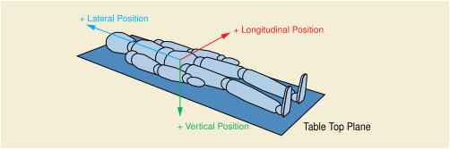
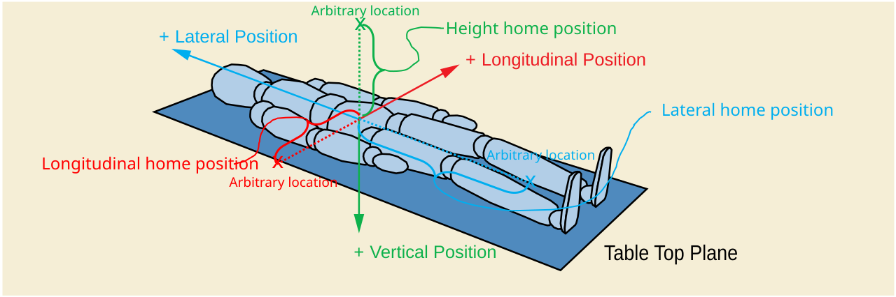
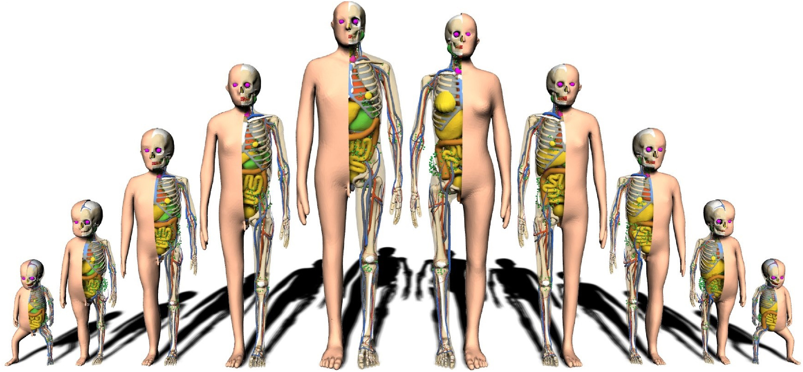
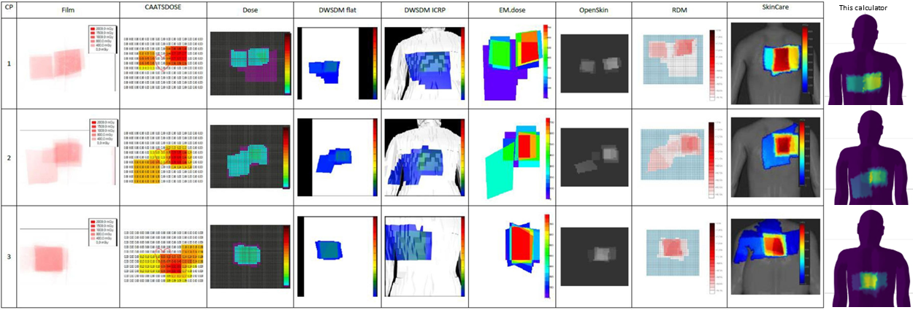
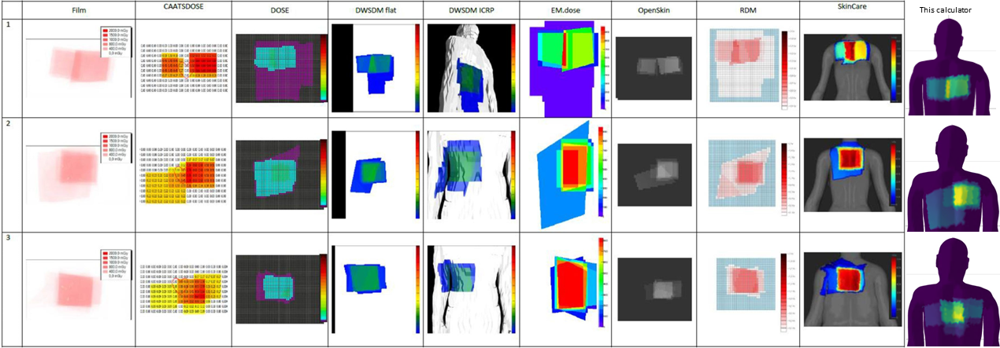
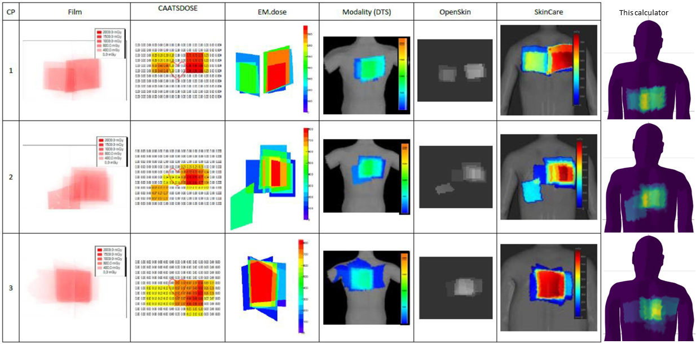
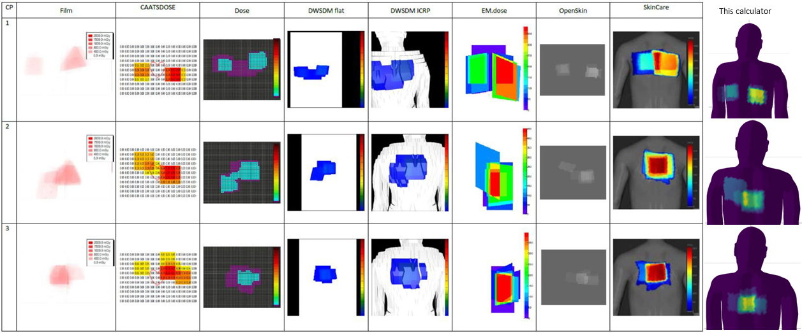

## Contents

-   Mathematics behind the geometry
-   Physics of estimating absorbed skin dose
-   Validation against film data and benchmarking against other calculators
-   References
-   Version history

# Mathematics

How is the geometry defined?

## Isocentre

:::: {.columns}
::: {.column width="40%"}
Equations,

\begin{equation}
\begin{pmatrix}x_{iso} \\ y_{iso} \\ z_{iso}\end{pmatrix} = 
\begin{pmatrix}0 \\ 0 \\ 0\end{pmatrix}
\end{equation}
:::

::: {.column width="60%"}

Visualisation,

```{r, fig.height=6, fig.width=8}
library(tidyverse)
library(plotly)

d <- data.frame(NA)
d$x_iso <- 0
d$y_iso <- 0
d$z_iso <- 0

d$x_iso <- as.numeric(d$x_iso)
d$y_iso <- as.numeric(d$y_iso)
d$z_iso <- as.numeric(d$z_iso)


fig <- plot_ly(d) %>%
  add_trace(x = ~x_iso, y = ~y_iso, z = ~z_iso, mode = 'scatter3d', type = 'scatter3d', name = "Isocenter", size = 2, marker = list(color = "magenta", line = list(color = "magenta"))) %>%
  layout(paper_bgcolor='transparent',
         showlegend = T,
         font = list(color = "white"),
         scene = list(xaxis = list(title = "Lateral (x)",
                                   range = c(-2, 2), 
                                   tickvals = c(-2, -1.5, -1, -0.5, 0, 0.5, 1, 1.5, 2),
                                   gridcolor = 'white',
                                   zerolinecolor = 'white',
                                   zerolinewidth = 1),
                      yaxis = list(title = "Longitudinal (y)", 
                                   range = c(1, -1), 
                                   tickvals = c(1, 0.5, 0, -0.5, -1),
                                   gridcolor = 'white',
                                   zerolinecolor = 'white',
                                   zerolinewidth = 1),
                      zaxis = list(title = "Height (z)", 
                                   range = c(1, -1), 
                                   tickvals = c(1, 0.5, 0, -0.5, -1),
                                   gridcolor = 'white',
                                   zerolinecolor = 'white',
                                   zerolinewidth = 1),
                      camera = list(eye = list(x = -1.5, y = 2.5, z = 1.25),
                                    center = list(x = 0, y = 0, z = -0.5)),
                      aspectratio = list(x = 2, y = 1, z = 1)))
fig

```

:::
::::

## Focal Spot

:::: {.columns}
::: {.column width="40%"}
Tube angulation in radians,

\begin{equation}
\begin{pmatrix} \theta \\ \phi \end{pmatrix} =
\begin{pmatrix}-Positioner\;Primary\;Angle \\
Positioner\;Secondary\;Angle\end{pmatrix}
\frac{\pi}{180}
\end{equation}

Coordinates,

\begin{equation}
\begin{pmatrix} x_{fs} \\ y_{fs} \\ z_{fs} \end{pmatrix} =
\begin{pmatrix}
-SIsoD \sin \phi \\
SIsoD \sin\theta \cos \phi \\
SIsoD \cos \theta \cos \phi
\end{pmatrix}
\end{equation}

:::

::: {.column width="60%"}

Visualisation,
\begin{equation}Positioner\;Primary\;Angle = 60\;degrees\end{equation}
\begin{equation}Positioner\;Secondary\;Angle = 25\;degrees\end{equation}
\begin{equation}SIsoD=Source\;to\;Isocentre\;Distance=785\;mm\end{equation}

```{r, fig.height=6, fig.width=8}
d$Positioner_Primary_Angle = 60
d$Positioner_Secondary_Angle = 25

d$theta <- -d$Positioner_Primary_Angle*(pi/180) # radians
d$phi <- d$Positioner_Secondary_Angle*(pi/180) # radians
d$Distance_Source_to_Isocenter <- 0.785

d$x_spot <- -d$Distance_Source_to_Isocenter*sin(d$phi) # eq 4 (modified)
d$y_spot <- d$Distance_Source_to_Isocenter*sin(d$theta)*cos(d$phi) # eq 5 (modified)
d$z_spot <- d$Distance_Source_to_Isocenter*cos(d$theta)*cos(d$phi) # eq 6

fig <- fig %>% add_trace(data = d, x = ~x_spot, y = ~y_spot, z = ~z_spot, mode = 'scatter3d', type = 'scatter3d', name = "Focal spot", size = 2, marker = list(color = "red", line = list(color = "red")))
fig
```
:::
::::

## Reference Point

:::: {.columns}
::: {.column width="40%"}

Coordinates, 
\begin{equation}
\begin{pmatrix}x_{rp} \\ y_{rp} \\ z_{rp}\end{pmatrix}=
\begin{pmatrix} -RPD \sin \phi \\
RPD \sin\theta \cos \phi \\
RPD \cos \theta \cos \phi
\end{pmatrix}
\end{equation}

:::
::: {.column width="60%"}

Visualisation,
\begin{equation}Reference\;Point\;Definition=RPD=0.15\;m\end{equation}

```{r, fig.height=6, fig.width=8}
d$x_RF <- -0.15*sin(d$phi) # eq 7 (modified)
d$y_RF <- 0.15*sin(d$theta)*cos(d$phi) # eq 8
d$z_RF <- 0.15*cos(d$theta)*cos(d$phi) # eq 9

fig <- fig %>% add_trace(data = d, x = ~x_RF, y = ~y_RF, z = ~z_RF, mode = 'scatter3d', type = 'scatter3d', name = "Reference Point", size = 2, marker = list(color = "orange", line = list(color = "orange")))
fig
```
:::
::::

## Detector (center)

:::: {.columns}
::: {.column width="40%"}
Coordinates,
\begin{equation}
\begin{pmatrix}x_{det} \\ y_{det} \\ z_{det}\end{pmatrix}=
\begin{pmatrix} \frac{x_{rp}-x_{fs}}{SIsoD-RPD} SDD+x_{fs} \\
\frac{y_{rp}-y_{fs}}{SIsoD-RPD} SDD+y_{fs} \\
\frac{z_{rp}-z_{fs}}{SIsoD-RPD} SDD+z_{fs}
\end{pmatrix}
\end{equation}

:::
::: {.column width="60%"}

Visualisation,
\begin{equation}Source\;Detector\;Distance=SDD=1.1\;m\end{equation}

```{r, fig.height=6, fig.width=8}
d$Distance_Source_to_Detector <- 1.1

d$x_det <- (-d$x_spot+d$x_RF)/(d$Distance_Source_to_Isocenter-0.15)*d$Distance_Source_to_Detector+d$x_spot # eq 7 (modified)
d$y_det <- (-d$y_spot+d$y_RF)/(d$Distance_Source_to_Isocenter-0.15)*d$Distance_Source_to_Detector+d$y_spot # eq 7 (modified)
d$z_det <- (-d$z_spot+d$z_RF)/(d$Distance_Source_to_Isocenter-0.15)*d$Distance_Source_to_Detector+d$z_spot # eq 7 (modified)

fig <- fig %>% add_trace(data = d, x = ~x_det, y = ~y_det, z = ~z_det, mode = 'scatter3d', type = 'scatter3d', name = "Detector (center)", size = 2, marker = list(color = "lightgreen", line = list(color = "lightgreen")))
fig
```
:::
::::

## Detector (corners)

:::: {.columns}
::: {.column width="40%"}

Beam area at the reference point,

\begin{equation}A_{rp}=KAP/k_{air}\end{equation}

Side length of beam at reference point,
\begin{equation}l_{rp}=\sqrt{A_{rp}}\end{equation}

Side length of beam at the detector,
\begin{equation}l_{det}=\frac{l_{rp}}{SIsoD-RPD} SDD\end{equation}

Find 2 orthogonal vectors (v, u) at the detector, (Khodadadegan, 2011)

\begin{equation}
\begin{pmatrix}v_{i} \\ v_{j} \\ v_{k}\end{pmatrix}=
\begin{pmatrix} \cos \phi \\
\sin \theta \sin \phi \\
\cos \theta \sin \phi
\end{pmatrix}
\end{equation} \begin{equation}
\begin{pmatrix}u_{i} \\ u_{j} \\ u_{k}\end{pmatrix}=
\begin{pmatrix} 0 \\
\cos \theta \\
-\sin \theta
\end{pmatrix}
\end{equation}

:::
::: {.column width="60%"}

Visualisation,

```{r, fig.height=6, fig.width=8}
d$KAP <- 2
d$k_air <- 166
d$A_rp <- d$KAP/d$k_air
d$l_rp <- sqrt(d$A_rp)
d$l_det <- d$l_rp/(d$Distance_Source_to_Isocenter - 0.15) * d$Distance_Source_to_Detector

d$v_i <- cos(d$phi)
d$v_j <- sin(d$theta)*sin(d$phi)
d$v_k <- cos(d$theta)*sin(d$phi)

d$u_i <- 0
d$u_j <- cos(d$theta)
d$u_k <- -sin(d$theta)

fig %>% 
  add_trace(x = ~c(d$x_det, d$v_i/2), y = ~c(d$y_det, d$v_j/2), z = ~c(d$z_det, d$v_k/2), mode = 'lines', type = 'scatter3d', name = "Orthoganol vector (v)", width = 3, line = list(color = "lightblue")) %>%
  add_trace(x = ~c(d$x_det, d$u_i/2), y = ~c(d$y_det, d$u_j/2), z = ~c(d$z_det, d$u_k/2), mode = 'lines', type = 'scatter3d', name = "Orthoganol vector (u)", width = 3, line = list(color = "pink"))
```
:::
::::

## Detector (corners) continued

:::: {.columns}
::: {.column width="40%"}

Coordinates of detector corner 1,

\begin{equation}
\begin{pmatrix}
x_{dc1} \\ y_{dc1} \\ z_{dc1}\end{pmatrix}=
\begin{pmatrix}x_{det}-\frac{l_{det}}{2} v_{i} + \frac{l_{det}}{2} u_{i} \\
y_{det}-\frac{l_{det}}{2} v_{j} + \frac{l_{det}}{2} u_{j} \\
z_{det}-\frac{l_{det}}{2} v_{k} + \frac{l_{det}}{2} u_{k} \\
\end{pmatrix}
\end{equation}

Coordinates of detector corner 2,

\begin{equation}
\begin{pmatrix}x_{dc2} \\ y_{dc2} \\ z_{dc2}\end{pmatrix}=
\begin{pmatrix}
x_{det}+\frac{l_{det}}{2} v_{i} - \frac{l_{det}}{2} u_{i} \\
y_{det}+\frac{l_{det}}{2} v_{j} - \frac{l_{det}}{2} u_{j} \\
z_{det}+\frac{l_{det}}{2} v_{k} - \frac{l_{det}}{2} u_{k} \\
\end{pmatrix}
\end{equation}

Coordinates of detector corner 3,

\begin{equation}
\begin{pmatrix}
x_{dc3} \\ y_{dc3} \\ z_{dc3}\end{pmatrix}=
\begin{pmatrix}
x_{det}-\frac{l_{det}}{2} v_{i} - \frac{l_{det}}{2} u_{i} \\
y_{det}-\frac{l_{det}}{2} v_{j} - \frac{l_{det}}{2} u_{j} \\
z_{det}-\frac{l_{det}}{2} v_{k} - \frac{l_{det}}{2} u_{k}
\end{pmatrix}
\end{equation}

Coordinates of detector corner 4, 
\begin{equation}
\begin{pmatrix}x_{dc4} \\ y_{dc4} \\ z_{tc4}\end{pmatrix}=
\begin{pmatrix}
x_{det}+\frac{l_{det}}{2} v_{i} + \frac{l_{det}}{2} u_{i} \\
y_{det}+\frac{l_{det}}{2} v_{j} + \frac{l_{det}}{2} u_{j} \\
z_{det}+\frac{l_{det}}{2} v_{k} + \frac{l_{det}}{2} u_{k}
\end{pmatrix}
\end{equation}

:::
::: {.column width="60%"}

Visualisation,
\begin{equation}KAP=0.03\;Gy\;m^{2}\end{equation}

\begin{equation}k_{air}=1.5\;mGy\end{equation}

```{r, fig.height=6, fig.width=8}

# corner 1, eq 17
d$x_dc1 <- d$x_det-d$l_det/2*d$v_i+d$l_det/2*d$u_i
d$y_dc1 <- d$y_det-d$l_det/2*d$v_j+d$l_det/2*d$u_j
d$z_dc1 <- d$z_det-d$l_det/2*d$v_k+d$l_det/2*d$u_k

# corner 2, eq 18
d$x_dc2 <- d$x_det+d$l_det/2*d$v_i-d$l_det/2*d$u_i
d$y_dc2 <- d$y_det+d$l_det/2*d$v_j-d$l_det/2*d$u_j
d$z_dc2 <- d$z_det+d$l_det/2*d$v_k-d$l_det/2*d$u_k

# corner 3, eq 19
d$x_dc3 <- d$x_det-d$l_det/2*d$v_i-d$l_det/2*d$u_i
d$y_dc3 <- d$y_det-d$l_det/2*d$v_j-d$l_det/2*d$u_j
d$z_dc3 <- d$z_det-d$l_det/2*d$v_k-d$l_det/2*d$u_k

# corner 4, eq 20
d$x_dc4 <- d$x_det+d$l_det/2*d$v_i+d$l_det/2*d$u_i
d$y_dc4 <- d$y_det+d$l_det/2*d$v_j+d$l_det/2*d$u_j
d$z_dc4 <- d$z_det+d$l_det/2*d$v_k+d$l_det/2*d$u_k

fig %>% 
  add_trace(data = d, x = ~x_dc1, y = ~y_dc1, z = ~z_dc1, mode = 'markers', type = 'scatter3d', name = "Detector Corner 1", size = 2, marker = list(color = "green", line = list(color = "green"))) %>%
  add_trace(data = d, x = ~x_dc2, y = ~y_dc2, z = ~z_dc2, mode = 'markers', type = 'scatter3d', name = "Detector Corner 2", size = 2, marker = list(color = "lightblue", line = list(color = "lightblue"))) %>%
  add_trace(data = d, x = ~x_dc3, y = ~y_dc3, z = ~z_dc3, mode = 'markers', type = 'scatter3d', name = "Detector Corner 3", size = 2, marker = list(color = "pink", line = list(color = "pink"))) %>%
  add_trace(data = d, x = ~x_dc4, y = ~y_dc4, z = ~z_dc4, mode = 'markers', type = 'scatter3d', name = "Detector Corner 4", size = 2, marker = list(color = "yellow", line = list(color = "yellow")))
```
:::
::::

## Source and Detector Geometry Complete!

```{r, fig.height=6, fig.width=10}
fig1 <- plot_ly(d) %>%
  add_trace(x = ~x_iso, y = ~y_iso, z = ~z_iso, type = 'scatter3d', mode = 'markers', name = "Isocenter", size = 2, marker = list(color = "magenta", line = list(color = "magenta"))) %>%
  add_trace(data = d, x = ~x_spot, y = ~y_spot, z = ~z_spot, type = 'scatter3d', mode = 'markers', name = "Focal spot", size = 2, marker = list(color = "red", line = list(color = "red"))) %>%
  add_trace(data = d, x = ~x_RF, y = ~y_RF, z = ~z_RF, type = 'scatter3d', mode = 'markers', name = "Reference Point", size = 2, marker = list(color = "orange", line = list(color = "orange"))) %>%
  add_trace(name = "Detector",
            x = ~c(d$x_dc1, d$x_dc2, d$x_dc3, d$x_dc4),
            y = ~c(d$y_dc1, d$y_dc2, d$y_dc3, d$y_dc4),
            z = ~c(d$z_dc1, d$z_dc2, d$z_dc3, d$z_dc4),
            type = "mesh3d",
            facecolor = rep("green", 12),
            flatshading = T,
            hovertext = ~paste("Detector"),
            hoverinfo = "text") %>% 
  add_trace(name = "Beam face 1",
            x = ~c(d$x_spot, d$x_dc1, d$x_dc3),
            y = ~c(d$y_spot, d$y_dc1, d$y_dc3),
            z = ~c(d$z_spot, d$z_dc1, d$z_dc3),
            type = "mesh3d",
            facecolor = rep("red", 12),
            opacity = 0.25,
            flatshading = T,
            hovertext = ~paste("beam face 1"),
            hoverinfo = "text") %>% 
  add_trace(name = "Beam face 2",
            x = ~c(d$x_spot, d$x_dc3, d$x_dc2),
            y = ~c(d$y_spot, d$y_dc3, d$y_dc2),
            z = ~c(d$z_spot, d$z_dc3, d$z_dc2),
            type = "mesh3d",
            facecolor = rep("red", 12),
            opacity = 0.25,
            flatshading = T,
            hovertext = ~paste("beam face 2"),
            hoverinfo = "text") %>% 
  add_trace(name = "Beam face 3",
            x = ~c(d$x_spot, d$x_dc4, d$x_dc1),
            y = ~c(d$y_spot, d$y_dc4, d$y_dc1),
            z = ~c(d$z_spot, d$z_dc4, d$z_dc1),
            type = "mesh3d",
            facecolor = rep("red", 12),
            opacity = 0.25,
            flatshading = T,
            hovertext = ~paste("beam face 3"),
            hoverinfo = "text") %>% 
  add_trace(name = "Beam face 4",
            x = ~c(d$x_spot, d$x_dc4, d$x_dc2),
            y = ~c(d$y_spot, d$y_dc4, d$y_dc2),
            z = ~c(d$z_spot, d$z_dc4, d$z_dc2),
            type = "mesh3d",
            facecolor = rep("red", 12),
            opacity = 0.25,
            flatshading = T,
            hovertext = ~paste("beam face 4"),
            hoverinfo = "text") %>% 
  add_trace(name = "Beam line 1",
            x = ~c(d$x_spot, d$x_dc1),
            y = ~c(d$y_spot, d$y_dc1),
            z = ~c(d$z_spot, d$z_dc1),
            type = "scatter3d",
            mode = "lines",
            line = list(color = "red", width = 3),
            hoverinfo = "none") %>% 
  add_trace(name = "Beam line 2",
            x = ~c(d$x_spot, d$x_dc2),
            y = ~c(d$y_spot, d$y_dc2),
            z = ~c(d$z_spot, d$z_dc2),
            type = "scatter3d",
            mode = "lines",
            line = list(color = "red", width = 3),
            hoverinfo = "none") %>% 
  add_trace(name = "Beam line 3",
            x = ~c(d$x_spot, d$x_dc3),
            y = ~c(d$y_spot, d$y_dc3),
            z = ~c(d$z_spot, d$z_dc3),
            type = "scatter3d",
            mode = "lines",
            line = list(color = "red", width = 3),
            hoverinfo = "none") %>% 
  add_trace(name = "Beam line 4",
            x = ~c(d$x_spot, d$x_dc4),
            y = ~c(d$y_spot, d$y_dc4),
            z = ~c(d$z_spot, d$z_dc4),
            type = "scatter3d",
            mode = "lines",
            line = list(color = "red", width = 3),
            hoverinfo = "none") %>% 
  layout(paper_bgcolor='transparent',
         showlegend = F,
         font = list(color = "white"),
         scene = list(xaxis = list(title = "Lateral (x)",
                                   range = c(-2, 2), 
                                   tickvals = c(-2, -1.5, -1, -0.5, 0, 0.5, 1, 1.5, 2),
                                   gridcolor = 'white',
                                   zerolinecolor = 'white',
                                   zerolinewidth = 1),
                      yaxis = list(title = "Longitudinal (y)", 
                                   range = c(1, -1), 
                                   tickvals = c(1, 0.5, 0, -0.5, -1),
                                   gridcolor = 'white',
                                   zerolinecolor = 'white',
                                   zerolinewidth = 1),
                      zaxis = list(title = "Height (z)", 
                                   range = c(1, -1), 
                                   tickvals = c(1, 0.5, 0, -0.5, -1),
                                   gridcolor = 'white',
                                   zerolinecolor = 'white',
                                   zerolinewidth = 1),
                      camera = list(eye = list(x = -1.5, y = 2.5, z = 1.25),
                                    center = list(x = 0, y = 0, z = 0)),
                      aspectratio = list(x = 2, y = 1, z = 1)))
fig1
```

## Table Movement

Table longitudinal, lateral and height positions are defined as the distance in mm from an arbitrary point. DICOM standard for movement of the patient support,

{width="100%"}\                                                        

## Table Movement (continued)

{width="100%"}\
\begin{equation}
\begin{pmatrix}\Delta x \\ \Delta y \\ \Delta z \end{pmatrix}=
\begin{pmatrix}
Table\;Lateral\;Position+Table\;Lateral\;Home\;Position \\
Table\;Longitudinal\;Position+Table\;Longitudinal\;Home\;Position \\
Table\;Height\;Position+Table\;Height\;Home\;Position
\end{pmatrix}
\end{equation}

## Table Height of Philips Systems

<br>

Philips have a private tag in their RDSRs, "Height of System". This tag defines the height of the isocenter above the floor. In this case, table height is calculated as follows, 
<br>
\begin{equation}\Delta z=Height\;of\;System-Table\;Height\;Position+Table\;Height\;Home\;Position\end{equation} 
<br>

In theory, the addition of the "Height of System" DICOM tag means that the Table Height Home Position is no longer needed.

## Table Geometry (head) {.scrollable}

:::: {.columns}
::: {.column width="50%"}
Table displacement,
\begin{equation}
\begin{pmatrix}\Delta x \\ \Delta y \\ \Delta z \end{pmatrix}=
\begin{pmatrix}
Table\;Lateral\;Position+Table\;Lateral\;Home\;Position \\
Table\;Longitudinal\;Position+Table\;Longitudinal\;Home\;Position \\
Table\;Height\;Position+Table\;Height\;Home\;Position
\end{pmatrix}
\end{equation}

Head support corner 1,
\begin{equation}
\begin{pmatrix}x_{hc1} \\ y_{hc1} \\ z_{hc1} \end{pmatrix}=
\begin{pmatrix}\Delta x+0.5 \\ \frac{Head\;Support\;Width}{2}+\Delta y \\ \Delta z\end{pmatrix}
\end{equation}

Head support corner 2,
\begin{equation}
\begin{pmatrix}x_{hc2} \\ y_{hc2} \\ z_{hc2}\end{pmatrix}=
\begin{pmatrix}\Delta x+0.5 \\ -\frac{Head\;Support\;Width}{2}+\Delta y \\ \Delta z\end{pmatrix}
\end{equation}

Head support corner 3, \begin{equation}
\begin{pmatrix}x_{hc3} \\ y_{hc3} \\ z_{hc3}\end{pmatrix}=
\begin{pmatrix}\Delta x+0.5-Head\;Support\;Length \\ \frac{Head\;Support\;Width}{2}+\Delta y \\ \Delta z\end{pmatrix}
\end{equation}

Head support corner 4,
\begin{equation}
\begin{pmatrix}x_{hc4} \\ y_{hc4} \\ z_{hc4}\end{pmatrix}=
\begin{pmatrix}\Delta x+0.5-Head\;Support\;Length \\ -\frac{Head\;Support\;Width}{2}+\Delta y \\ \Delta z\end{pmatrix}
\end{equation}
:::

::: {.column width="50%"}
Factors chosen,
\begin{equation}Table\;Lateral\;Position=400mm\end{equation}

\begin{equation}Table\;Lateral\;Position=250\;mm\end{equation} 
\begin{equation}Table\;Longitudinal\;Position=450\;mm\end{equation} 
\begin{equation}Table\;Height\;Position=30\;mm\end{equation}

\begin{equation}Table\;Lateral\;Home\;Position=-200\;mm\end{equation} 
\begin{equation}Table\;Longitudinal\;Home\;Position=-400\;mm\end{equation}
\begin{equation}Table\;Height\;Home\;Position=80\;mm\end{equation}

\begin{equation}Head\;Support\;Length=250\;mm\end{equation}
\begin{equation}Head\;Support\;Width=150\;mm\end{equation}
:::
::::

Visualisation,

```{r}
d$Table_Lateral_Position <- 0.25
d$Table_Longitudinal_Position <- 0.45
d$Table_Height_Position <- 0.03

d$Table_Lateral_home_position <- -0.2
d$Table_Longitudinal_home_position <- -0.4
d$Table_height_home_position <- 0.08

d$hs_length <- 0.25
d$hs_width <- 0.15

d$delta_x <- d$Table_Lateral_Position+d$Table_Lateral_home_position
d$delta_y <- d$Table_Longitudinal_Position+d$Table_Longitudinal_home_position
d$delta_z <- d$Table_Height_Position+d$Table_height_home_position

d$x_hs1 <- d$delta_x+0.5
d$y_hs1 <- d$hs_width/2+d$delta_y

d$x_hs4 <- d$delta_x+0.5
d$y_hs4 <- -d$hs_width/2+d$delta_y

d$x_hs3 <- d$delta_x+0.5-d$hs_length
d$y_hs3 <- d$hs_width/2+d$delta_y

d$x_hs2 <- d$delta_x+0.5-d$hs_length
d$y_hs2 <- -d$hs_width/2+d$delta_y

fig <- plot_ly() %>%
  add_trace(data = d, x = ~x_hs1, y = ~y_hs1, z = ~delta_z, mode = 'markers', type = 'scatter3d', name = "Head Support Corner 1", size = 2, marker = list(color = "green", line = list(color = "green"))) %>%
  add_trace(data = d, x = ~x_hs2, y = ~y_hs2, z = ~delta_z, mode = 'markers', type = 'scatter3d', name = "Head Support Corner 2", size = 2, marker = list(color = "lightblue", line = list(color = "lightblue"))) %>%
  add_trace(data = d, x = ~x_hs3, y = ~y_hs3, z = ~delta_z, mode = 'markers', type = 'scatter3d', name = "Head Support Corner 3", size = 2, marker = list(color = "pink", line = list(color = "pink"))) %>%
  add_trace(data = d, x = ~x_hs4, y = ~y_hs4, z = ~delta_z, mode = 'markers', type = 'scatter3d', name = "Head Support Corner 4", size = 2, marker = list(color = "yellow", line = list(color = "yellow"))) %>%
  layout(paper_bgcolor='transparent',
         showlegend = T,
         font = list(color = "white"),
         scene = list(xaxis = list(title = "Lateral (x)",
                                   range = c(-2, 2), 
                                   tickvals = c(-2, -1.5, -1, -0.5, 0, 0.5, 1, 1.5, 2),
                                   gridcolor = 'white',
                                   zerolinecolor = 'white',
                                   zerolinewidth = 1),
                      yaxis = list(title = "Longitudinal (y)", 
                                   range = c(1, -1), 
                                   tickvals = c(1, 0.5, 0, -0.5, -1),
                                   gridcolor = 'white',
                                   zerolinecolor = 'white',
                                   zerolinewidth = 1),
                      zaxis = list(title = "Height (z)", 
                                   range = c(1, -1), 
                                   tickvals = c(1, 0.5, 0, -0.5, -1),
                                   gridcolor = 'white',
                                   zerolinecolor = 'white',
                                   zerolinewidth = 1),
                      camera = list(eye = list(x = -1.5, y = 2.5, z = 1.25),
                                    center = list(x = 0, y = 0, z = -0.5)),
                      aspectratio = list(x = 2, y = 1, z = 1)))
fig
```

## Table Geometry (body)

:::: {.columns}
::: {.column width="40%"}

Body support corner 1,

\begin{equation}
\begin{pmatrix}x_{bc1} \\ y_{bc1} \\ z_{bc1}\end{pmatrix}=
\begin{pmatrix}
\Delta x+0.5-Head\;Support\;Length \\
\frac{Table\;Width}{2}+\Delta y \\ \Delta z
\end{pmatrix}
\end{equation}

Body support corner 2,

\begin{equation}
\begin{pmatrix}x_{bc2} \\ y_{bc2} \\ z_{bc2}\end{pmatrix}=
\begin{pmatrix}
\Delta x+0.5 - Table\;Length - Head\;Support\;Length\\
-\frac{Table\;Width}{2}+\Delta y \\ \Delta z
\end{pmatrix}
\end{equation}

Body support corner 3,

\begin{equation}
\begin{pmatrix}x_{bc3} \\ y_{bc3} \\ z_{bc3}\end{pmatrix}=
\begin{pmatrix}
\Delta x+0.5 - Table\;Length - Head\;Support\;Length\\
\frac{Table\;Width}{2}+\Delta y \\ \Delta z
\end{pmatrix}
\end{equation}

Body support corner 4,

\begin{equation}
\begin{pmatrix}x_{bc4} \\ y_{bc4} \\ z_{bc4}\end{pmatrix}=
\begin{pmatrix}
\Delta x+0.5 - Head\;Support\;Length \\
-\frac{Table\;Width}{2}+\Delta y \\ \Delta z
\end{pmatrix}
\end{equation}

:::
::: {.column width="60%"}

Factors chosen,

\begin{equation}Body\;Support\;Length=2000\;mm\end{equation}

\begin{equation}Body\;Support\;Width=600\;mm\end{equation}

Visualisation,

```{r, fig.height=6, fig.width=8}
d$bs_width <- 0.6
d$bs_length <- 2

d$x_bs1 <- d$delta_x+0.5-d$hs_length
d$y_bs1 <- d$bs_width/2+d$delta_y

d$x_bs4 <- d$delta_x+0.5-d$hs_length
d$y_bs4 <- -d$bs_width/2+d$delta_y

d$x_bs3 <- d$delta_x+0.5-d$bs_length-d$hs_length
d$y_bs3 <- d$bs_width/2+d$delta_y

d$x_bs2 <- d$delta_x+0.5-d$bs_length-d$hs_length
d$y_bs2 <- -d$bs_width/2+d$delta_y

fig <- fig %>%
  add_trace(data = d, x = ~x_bs1, y = ~y_bs1, z = ~delta_z, mode = 'markers', type = 'scatter3d', name = "Body Support Corner 1", size = 2, marker = list(color = "blue", line = list(color = "blue"))) %>%
  add_trace(data = d, x = ~x_bs2, y = ~y_bs2, z = ~delta_z, mode = 'markers', type = 'scatter3d', name = "Body Support Corner 2", size = 2, marker = list(color = "magenta", line = list(color = "magenta"))) %>%
  add_trace(data = d, x = ~x_bs3, y = ~y_bs3, z = ~delta_z, mode = 'markers', type = 'scatter3d', name = "Body Support Corner 3", size = 2, marker = list(color = "cyan", line = list(color = "cyan"))) %>%
  add_trace(data = d, x = ~x_bs4, y = ~y_bs4, z = ~delta_z, mode = 'markers', type = 'scatter3d', name = "Body Support Corner 4", size = 2, marker = list(color = "orange", line = list(color = "orange")))
fig
```

:::
::::

## Table Geometry Complete!

```{r, fig.height=8, fig.width=10, fig.align='center'}
fig1 <- fig1 %>%
  add_trace(name = "Patient table (head)",
            x = ~c(d$x_hs1, d$x_hs2, d$x_hs3, d$x_hs4),
            y = ~c(d$y_hs1, d$y_hs2, d$y_hs3, d$y_hs4),
            z = ~c(d$delta_z, d$delta_z, d$delta_z, d$delta_z),
            type = "mesh3d",
            opacity = 0.7,
            facecolor = rep("white", 12),
            flatshading = T,
            hovertext = ~paste("Patient table (head)"),
            hoverinfo = "text") %>%
  add_trace(name = "Patient table (body)",
            x = ~c(d$x_bs1, d$x_bs2, d$x_bs3, d$x_bs4),
            y = ~c(d$y_bs1, d$y_bs2, d$y_bs3, d$y_bs4),
            z = ~c(d$delta_z, d$delta_z, d$delta_z, d$delta_z),
            type = "mesh3d",
            opacity = 0.7,
            facecolor = rep("white", 12),
            flatshading = T,
            hovertext = ~paste("Patient table (body)"),
            hoverinfo = "text")
fig1
```

## 3D Human Phantoms {.scrollable}

| Age       | Height | Weight | Gender |    Source |
|-----------|--------|--------|--------|----------:|
| 0 years   | -      | 3.5 kg | M      | ICRP 156  |
| 0 years   | -      | 3.5 kg | F      | ICRP 156  |
| 1 year    | 76 cm  | 10 kg  | M      | ICRP 156  |
| 1 year    | 76 cm  | 10 kg  | F      | ICRP 156  |
| 5 years   | 109 cm | 19 kg  | M      | ICRP 156  |
| 5 years   | 109 cm | 19 kg  | F      | ICRP 156  |
| 10 years  | 138 cm | 32 kg  | M      | ICRP 156  |
| 10 years  | 138 cm | 32 kg  | F      | ICRP 156  |
| 15 years  | 167 cm | 56 kg  | M      | ICRP 156  |
| 15 years  | 161 cm | 53 kg  | F      | ICRP 156  |
| Adult     | 176 cm | 73 kg  | M      | ICRP 145  |
| Adult     | 163 cm | 60 kg  | F      | ICRP 145  |

{height="100%"}\

## Phantom Geometry

:::: {.columns}
::: {.column width="40%"}
Each phantom is essentially a cloud of x, y and z coordinates

\begin{equation}
\begin{pmatrix} x_{phantom} \\ y_{phantom} \\ z_{phantom} \end{pmatrix}=
\begin{pmatrix}
-1.238573, -1.235325, -1.234731, ... \\
0.1232661, 0.1224177, 0.1236992, ... \\
-0.231287, -0.229309, -0.232391, ...
\end{pmatrix}
\end{equation}

:::
::: {.column width="60%"}

Apex of patient's head,
\begin{equation}x_{phantom}=0.5\end{equation}

Phantom is centered on y-axis.

Coordinate of most posterior point on the patient,
\begin{equation}z_{phantom}=0\end{equation}

:::
::::

```{r, fig.height=5, fig.width=10}
phantom <- readRDS('icrp145male.rds')
plot_ly(data = phantom) %>%
  add_trace(name = "ICRP 145 Male", x = ~x, y = ~y, z = ~z, i = ~i, j = ~j, k = ~k, type = "mesh3d") %>% 
  layout(paper_bgcolor='transparent',
         showlegend = T,
         font = list(color = "white"),
         scene = list(xaxis = list(title = "Lateral (x)",
                                   range = c(-2, 2), 
                                   tickvals = c(-2, -1.5, -1, -0.5, 0, 0.5, 1, 1.5, 2),
                                   gridcolor = 'white',
                                   zerolinecolor = 'white',
                                   zerolinewidth = 1),
                      yaxis = list(title = "Longitudinal (y)", 
                                   range = c(1, -1), 
                                   tickvals = c(1, 0.5, 0, -0.5, -1),
                                   gridcolor = 'white',
                                   zerolinecolor = 'white',
                                   zerolinewidth = 1),
                      zaxis = list(title = "Height (z)", 
                                   range = c(1, -1), 
                                   tickvals = c(1, 0.5, 0, -0.5, -1),
                                   gridcolor = 'white',
                                   zerolinecolor = 'white',
                                   zerolinewidth = 1),
                      camera = list(eye = list(x = -1.5, y = 2.5, z = 1.25),
                                    center = list(x = 0, y = 0, z = -0.5)),
                      aspectratio = list(x = 2, y = 1, z = 1)))
```

## Phantom Geometry (continued)

:::: {.columns}
::: {.column width="40%"}
As the patient lies on the table, the back of the patient conforms to the flat surface. Therefore it is necessary to flatten the back of the phantom.

For all z coordinates of the phantom,
\begin{equation}z_{phantom_{flat}}=z_{phantom}+3\;cm\end{equation}

\begin{equation}z_{phantom_{flat}}<0 \rightarrow z_{phantom_{flat}}=0\end{equation}

:::
::: {.column width="60%"}

Visualisation,

```{r, fig.height=6, fig.width=7.5}
phantom$z_flat <- phantom$z + 0.03
phantom$z_flat <- ifelse(phantom$z_flat > 0, 0, phantom$z_flat)


fig <- plot_ly(data = phantom) %>%
  add_trace(name = "ICRP 145 Male", x = ~x, y = ~y, z = ~z_flat, i = ~i, j = ~j, k = ~k, type = "mesh3d") %>% 
  layout(paper_bgcolor='transparent',
         showlegend = T,
         font = list(color = "white"),
         scene = list(xaxis = list(title = "Lateral (x)",
                                   range = c(-2, 2), 
                                   tickvals = c(-2, -1.5, -1, -0.5, 0, 0.5, 1, 1.5, 2),
                                   gridcolor = 'white',
                                   zerolinecolor = 'white',
                                   zerolinewidth = 1),
                      yaxis = list(title = "Longitudinal (y)", 
                                   range = c(1, -1), 
                                   tickvals = c(1, 0.5, 0, -0.5, -1),
                                   gridcolor = 'white',
                                   zerolinecolor = 'white',
                                   zerolinewidth = 1),
                      zaxis = list(title = "Height (z)", 
                                   range = c(1, -1), 
                                   tickvals = c(1, 0.5, 0, -0.5, -1),
                                   gridcolor = 'white',
                                   zerolinecolor = 'white',
                                   zerolinewidth = 1),
                      camera = list(eye = list(x = -1.5, y = 2.5, z = 1.25),
                                    center = list(x = 0, y = 0, z = -0.5)),
                      aspectratio = list(x = 2, y = 1, z = 1)))
fig
```

:::
::::

## Patient Movement

:::: {.columns}
::: {.column width="40%"}

The patient moves with the table and therefore the x, y and z coordinates of the phantom must be shifted by the same amount. Adjusted patient phantom coordinates,

\begin{equation}
\begin{pmatrix}x_{adjusted} \\ y_{adjusted} \\ z_{adjusted}\end{pmatrix}=
\begin{pmatrix}
x_{phantom} + \Delta x - \Delta h \\
y_{phantom} + \Delta y \\
z_{phantom_{flat}} + \Delta z \\
\end{pmatrix}
\end{equation}

:::
::: {.column width="60%"}

Chosen values, 

\begin{equation}Distance\;from\;patient's\;head\;to\;end\;of\;table=\Delta h=0.05\end{equation}

Visualisation,

```{r, fig.height=6, fig.width=7.5}
d$delta_h <- 0.05
phantom$x_adj <- phantom$x+d$delta_x-d$delta_h
phantom$y_adj <- phantom$y+d$delta_y
phantom$z_adj <- phantom$z_flat+d$delta_z

fig <- plot_ly(data = phantom) %>%
  add_trace(name = "ICRP 145 Male", x = ~x_adj, y = ~y_adj, z = ~z_adj, i = ~i, j = ~j, k = ~k, type = "mesh3d") %>% 
  layout(paper_bgcolor='transparent',
         showlegend = T,
         font = list(color = "white"),
         scene = list(xaxis = list(title = "Lateral (x)",
                                   range = c(-2, 2), 
                                   tickvals = c(-2, -1.5, -1, -0.5, 0, 0.5, 1, 1.5, 2),
                                   gridcolor = 'white',
                                   zerolinecolor = 'white',
                                   zerolinewidth = 1),
                      yaxis = list(title = "Longitudinal (y)", 
                                   range = c(1, -1), 
                                   tickvals = c(1, 0.5, 0, -0.5, -1),
                                   gridcolor = 'white',
                                   zerolinecolor = 'white',
                                   zerolinewidth = 1),
                      zaxis = list(title = "Height (z)", 
                                   range = c(1, -1), 
                                   tickvals = c(1, 0.5, 0, -0.5, -1),
                                   gridcolor = 'white',
                                   zerolinecolor = 'white',
                                   zerolinewidth = 1),
                      camera = list(eye = list(x = -1.5, y = 2.5, z = 1.25),
                                    center = list(x = 0, y = 0, z = -0.5)),
                      aspectratio = list(x = 2, y = 1, z = 1)))
fig
```

:::
::::

## Phantom Geometry is Complete!

```{r, fig.height=8, fig.width=10}
fig1 %>% add_trace(name = "ICRP 145 Male", x = ~phantom$x_adj, y = ~phantom$y_adj, z = ~phantom$z_adj, i = ~phantom$i, j = ~phantom$j, k = ~phantom$k, type = "mesh3d", opacity = 0.5)
```

## How do we know which points are irradiated?

The X-Ray beam is defined as a square based pyramid with each of the detector corners and the apex at the focal spot. We can construct a plane in 3D space to represent the 4 triangular surfaces of this pyramid.

<br>

The general equation for a plane in 3D space is, $\begin{equation}Ax+By+Cz+D=0 \end{equation}$

<br>

Where, $\begin{equation}\langle A,B,C \rangle \end{equation}$ is a vector normal to the plane.

<br>

$\begin{equation}(x,y,z)\end{equation}$ represents any point on the plane.

## Determining Which Points Are Irradiated {.scrollable}

Calculation of Beam Plane Coefficients

<br>

Plane between detector corners 1 and 4

\begin{equation}
\begin{pmatrix}A_{beam 1} \\ B_{beam 1} \\ C_{beam 1} \\ D_{beam 1}\end{pmatrix}=
\begin{pmatrix}
y_{fs} (z_{dc1}-z_{dc4})+y_{dc1}(z_{dc4}-z_{fs})+y_{dc4} (z_{fs}-z_{dc1}) \\
z_{fs} (x_{dc1}-x_{dc4})+z_{dc1}(x_{dc4}-x_{fs})+z_{dc4} (x_{fs}-x_{dc1}) \\
x_{fs} (y_{dc1}-y_{dc4})+x_{dc1}(y_{dc4}-y_{fs})+x_{dc4} (y_{fs}-y_{dc1}) \\
x_{fs} (y_{dc1} z_{dc4}-y_{dc4} z_{dc1})-x_{dc1} (y_{dc4} z_{fs}-y_{fs} z_{dc4})-x_{dc4} (y_{fs} z_{dc1}-y_{dc1} z_{fs}) 
\end{pmatrix}
\end{equation}

Plane between detector corners 4 and 2

\begin{equation}
\begin{pmatrix}A_{beam 2} \\ B_{beam 2} \\ C_{beam 2} \\ D_{beam 2}\end{pmatrix}=
\begin{pmatrix}
y_{fs} (z_{dc4}-z_{dc2})+y_{dc4}(z_{dc2}-z_{fs})+y_{dc2} (z_{fs}-z_{dc4}) \\
z_{fs} (x_{dc4}-x_{dc2})+z_{dc4}(x_{dc2}-x_{fs})+z_{dc2} (x_{fs}-x_{dc4}) \\
x_{fs} (y_{dc4}-y_{dc2})+x_{dc4}(y_{dc2}-y_{fs})+x_{dc2} (y_{fs}-y_{dc4}) \\
x_{fs} (y_{dc4} z_{dc2}-y_{dc2} z_{dc4})-x_{dc4} (y_{dc2} z_{fs}-y_{fs} z_{dc2})-x_{dc2} (y_{fs} z_{dc4}-y_{dc4} z_{fs}) 
\end{pmatrix}
\end{equation}

Plane between detector corners 2 and 3

\begin{equation}
\begin{pmatrix}A_{beam 3} \\ B_{beam 3} \\ C_{beam 3} \\ D_{beam 3}\end{pmatrix}=
\begin{pmatrix}
y_{fs} (z_{dc2}-z_{dc3})+y_{dc2}(z_{dc3}-z_{fs})+y_{dc3} (z_{fs}-z_{dc2}) \\
z_{fs} (x_{dc2}-x_{dc3})+z_{dc2}(x_{dc3}-x_{fs})+z_{dc3} (x_{fs}-x_{dc2}) \\
x_{fs} (y_{dc2}-y_{dc3})+x_{dc2}(y_{dc3}-y_{fs})+x_{dc3} (y_{fs}-y_{dc2}) \\
x_{fs} (y_{dc2} z_{dc3}-y_{dc3} z_{dc2})-x_{dc2} (y_{dc3} z_{fs}-y_{fs} z_{dc3})-x_{dc3} (y_{fs} z_{dc2}-y_{dc2} z_{fs}) 
\end{pmatrix}
\end{equation}

Plane between detector corners 3 and 1

\begin{equation}
\begin{pmatrix}A_{beam 4} \\ B_{beam 4} \\ C_{beam 4} \\ D_{beam 4}\end{pmatrix}=
\begin{pmatrix}
y_{fs} (z_{dc3}-z_{dc1})+y_{dc3}(z_{dc1}-z_{fs})+y_{dc1} (z_{fs}-z_{dc3}) \\
z_{fs} (x_{dc3}-x_{dc1})+z_{dc3}(x_{dc1}-x_{fs})+z_{dc1} (x_{fs}-x_{dc3}) \\
x_{fs} (y_{dc3}-y_{dc1})+x_{dc3}(y_{dc1}-y_{fs})+x_{dc1} (y_{fs}-y_{dc3}) \\
x_{fs} (y_{dc3} z_{dc1}-y_{dc1} z_{dc3})-x_{dc3} (y_{dc1} z_{fs}-y_{fs} z_{dc1})-x_{dc1} (y_{fs} z_{dc3}-y_{dc3} z_{fs}) 
\end{pmatrix}
\end{equation}

```{r}
# Beam pyramid (this pyramid is different from that in the paper as it uses the source and detector to define the pyramid to define the corners, not the coordinates at the PERP.)
# Face 1 (c1, c4)
d$A1 <- d$y_spot*(d$z_dc1-d$z_dc4)+d$y_dc1*(d$z_dc4-d$z_spot)+d$y_dc4*(d$z_spot-d$z_dc1) # eq 21
d$B1 <- d$z_spot*(d$x_dc1-d$x_dc4)+d$z_dc1*(d$x_dc4-d$x_spot)+d$z_dc4*(d$x_spot-d$x_dc1) # eq 22
d$C1 <- d$x_spot*(d$y_dc1-d$y_dc4)+d$x_dc1*(d$y_dc4-d$y_spot)+d$x_dc4*(d$y_spot-d$y_dc1) # eq 23
d$D1 <- -d$x_spot*(d$y_dc1*d$z_dc4-d$y_dc4*d$z_dc1)-d$x_dc1*(d$y_dc4*d$z_spot-d$y_spot*d$z_dc4)-d$x_dc4*(d$y_spot*d$z_dc1-d$y_dc1*d$z_spot) # eq 24

# Face 2 (c4, c2)
d$A2 <- d$y_spot*(d$z_dc4-d$z_dc2)+d$y_dc4*(d$z_dc2-d$z_spot)+d$y_dc2*(d$z_spot-d$z_dc4) # eq 21
d$B2 <- d$z_spot*(d$x_dc4-d$x_dc2)+d$z_dc4*(d$x_dc2-d$x_spot)+d$z_dc2*(d$x_spot-d$x_dc4) # eq 22
d$C2 <- d$x_spot*(d$y_dc4-d$y_dc2)+d$x_dc4*(d$y_dc2-d$y_spot)+d$x_dc2*(d$y_spot-d$y_dc4) # eq 23
d$D2 <- -d$x_spot*(d$y_dc4*d$z_dc2-d$y_dc2*d$z_dc4)-d$x_dc4*(d$y_dc2*d$z_spot-d$y_spot*d$z_dc2)-d$x_dc2*(d$y_spot*d$z_dc4-d$y_dc4*d$z_spot) # eq 24

# Face 3 (c2, c3)
d$A3 <- d$y_spot*(d$z_dc2-d$z_dc3)+d$y_dc2*(d$z_dc3-d$z_spot)+d$y_dc3*(d$z_spot-d$z_dc2) # eq 21
d$B3 <- d$z_spot*(d$x_dc2-d$x_dc3)+d$z_dc2*(d$x_dc3-d$x_spot)+d$z_dc3*(d$x_spot-d$x_dc2) # eq 22
d$C3 <- d$x_spot*(d$y_dc2-d$y_dc3)+d$x_dc2*(d$y_dc3-d$y_spot)+d$x_dc3*(d$y_spot-d$y_dc2) # eq 23
d$D3 <- -d$x_spot*(d$y_dc2*d$z_dc3-d$y_dc3*d$z_dc2)-d$x_dc2*(d$y_dc3*d$z_spot-d$y_spot*d$z_dc3)-d$x_dc3*(d$y_spot*d$z_dc2-d$y_dc2*d$z_spot) # eq 24

# Face 4 (c3, c1)
d$A4 <- d$y_spot*(d$z_dc3-d$z_dc1)+d$y_dc3*(d$z_dc1-d$z_spot)+d$y_dc1*(d$z_spot-d$z_dc3) # eq 21
d$B4 <- d$z_spot*(d$x_dc3-d$x_dc1)+d$z_dc3*(d$x_dc1-d$x_spot)+d$z_dc1*(d$x_spot-d$x_dc3) # eq 22
d$C4 <- d$x_spot*(d$y_dc3-d$y_dc1)+d$x_dc3*(d$y_dc1-d$y_spot)+d$x_dc1*(d$y_spot-d$y_dc3) # eq 23
d$D4 <- -d$x_spot*(d$y_dc3*d$z_dc1-d$y_dc1*d$z_dc3)-d$x_dc3*(d$y_dc1*d$z_spot-d$y_spot*d$z_dc1)-d$x_dc1*(d$y_spot*d$z_dc3-d$y_dc3*d$z_spot) # eq 24
```

## Determining Which Points Are Irradiated (continued) {.scrollable}

For each coordinate of the phantom, 

\begin{equation}
\begin{pmatrix}
A_{beam 1}x_{adjusted}+B_{beam 1}y_{adjusted}+C_{beam 1}z_{adjusted}+D_{beam 1} \\
A_{beam 2}x_{adjusted}+B_{beam 2}y_{adjusted}+C_{beam 2}z_{adjusted}+D_{beam 2} \\
A_{beam 3}x_{adjusted}+B_{beam 3}y_{adjusted}+C_{beam 3}z_{adjusted}+D_{beam 3} \\
A_{beam 4}x_{adjusted}+B_{beam 4}y_{adjusted}+C_{beam 4}z_{adjusted}+D_{beam 4}
\end{pmatrix}
> 0 \rightarrow Coordinate\;is\;irradiated
\end{equation}

```{r, fig.height=8, fig.width=10}
phantom$`is point irradiated?` <- ifelse(d$A1*phantom$x_adj+d$B1*phantom$y_adj+d$C1*phantom$z_adj+d$D1 > 0 & # Face 1
                                           d$A2*phantom$x_adj+d$B2*phantom$y_adj+d$C2*phantom$z_adj+d$D2 > 0 & # Face 2
                                           d$A3*phantom$x_adj+d$B3*phantom$y_adj+d$C3*phantom$z_adj+d$D3 > 0 & # Face 3
                                           d$A4*phantom$x_adj+d$B4*phantom$y_adj+d$C4*phantom$z_adj+d$D4 > 0, # Face 4
                                         255, 50)
fig1 %>%
  add_trace(data = phantom, name = "ICRP 145 Male", type = "mesh3d",
            x = ~x_adj, y = ~y_adj, z = ~z_adj, i = ~i, j = ~j, k = ~k,
            vertexcolor = ~`is point irradiated?`,
            opacity = 0.5)
```

## What about the skin on the far side of the patient? {.scrollable}

To account for this, a 5th condition is introduced called the hit rejection distance,

The distance between the focal spot and the each point on the patient's skin is calculated.

\begin{equation}Source\;to\;Skin\;Distance=SSkinD=\sqrt{(x_{adjusted}-x_{fs})^2+(y_{adjusted}-y_{fs})^2+(z_{adjusted}-z_{fs})^2}\end{equation}

and this distance is compared to the distance from the focal spot to the hit rejection plane.

Therefore, for each coordinate of the phantom,
\begin{equation}\begin{pmatrix}
A_{beam 1}x_{adjusted}+B_{beam 1}y_{adjusted}+C_{beam 1}z_{adjusted}+D_{beam 1} \\
A_{beam 2}x_{adjusted}+B_{beam 2}y_{adjusted}+C_{beam 2}z_{adjusted}+D_{beam 2} \\
A_{beam 3}x_{adjusted}+B_{beam 3}y_{adjusted}+C_{beam 3}z_{adjusted}+D_{beam 3} \\
A_{beam 4}x_{adjusted}+B_{beam 4}y_{adjusted}+C_{beam 4}z_{adjusted}+D_{beam 4}
\end{pmatrix}
> 0 \rightarrow Coordinate\;is\;irradiated
\end{equation}

and,
\begin{equation}SSkinD < SDD-Hit\;Rejection\;Distance\end{equation}
<br>
\begin{equation}Hit\;Rejection\;Distance=0.3\;m\end{equation}

Visualisation,

```{r}
d$HRD <- 0.35 # hit rejection distance

# hit rejection coords
d$x_HR <- (-d$x_spot+d$x_RF)/(d$Distance_Source_to_Isocenter-0.15)*(d$Distance_Source_to_Detector-d$HRD)+d$x_spot # eq 7 (modified)
d$y_HR <- (-d$y_spot+d$y_RF)/(d$Distance_Source_to_Isocenter-0.15)*(d$Distance_Source_to_Detector-d$HRD)+d$y_spot # eq 7 (modified)
d$z_HR <- (-d$z_spot+d$z_RF)/(d$Distance_Source_to_Isocenter-0.15)*(d$Distance_Source_to_Detector-d$HRD)+d$z_spot # eq 7 (modified)

# side length at hit rejection point
d$l_HR <- d$l_rp/(d$Distance_Source_to_Isocenter-0.15)*(d$Distance_Source_to_Detector-d$HRD)

# corners at hit rejection point
# corner 1, eq 17
d$x_HR1 <- d$x_HR-d$l_HR/2*d$v_i+d$l_HR/2*d$u_i
d$y_HR1 <- d$y_HR-d$l_HR/2*d$v_j+d$l_HR/2*d$u_j
d$z_HR1 <- d$z_HR-d$l_HR/2*d$v_k+d$l_HR/2*d$u_k

# corner 2, eq 18
d$x_HR2 <- d$x_HR+d$l_HR/2*d$v_i-d$l_HR/2*d$u_i
d$y_HR2 <- d$y_HR+d$l_HR/2*d$v_j-d$l_HR/2*d$u_j
d$z_HR2 <- d$z_HR+d$l_HR/2*d$v_k-d$l_HR/2*d$u_k

# corner 3, eq 19
d$x_HR3 <- d$x_HR-d$l_HR/2*d$v_i-d$l_HR/2*d$u_i
d$y_HR3 <- d$y_HR-d$l_HR/2*d$v_j-d$l_HR/2*d$u_j
d$z_HR3 <- d$z_HR-d$l_HR/2*d$v_k-d$l_HR/2*d$u_k

# corner 4, eq 20
d$x_HR4 <- d$x_HR+d$l_HR/2*d$v_i+d$l_HR/2*d$u_i
d$y_HR4 <- d$y_HR+d$l_HR/2*d$v_j+d$l_HR/2*d$u_j
d$z_HR4 <- d$z_HR+d$l_HR/2*d$v_k+d$l_HR/2*d$u_k

phantom$SSkinDist <- sqrt((phantom$x_adj-d$x_spot)^2+(phantom$y_adj-d$y_spot)^2+(phantom$z_adj-d$z_spot)^2) # eq 10

phantom$`is point irradiated?` <- ifelse(d$A1*phantom$x_adj+d$B1*phantom$y_adj+d$C1*phantom$z_adj+d$D1 > 0 & # Face 1
                                           d$A2*phantom$x_adj+d$B2*phantom$y_adj+d$C2*phantom$z_adj+d$D2 > 0 & # Face 2
                                           d$A3*phantom$x_adj+d$B3*phantom$y_adj+d$C3*phantom$z_adj+d$D3 > 0 & # Face 3
                                           d$A4*phantom$x_adj+d$B4*phantom$y_adj+d$C4*phantom$z_adj+d$D4 > 0 & # Face 4
                                           phantom$SSkinDist < d$Distance_Source_to_Detector-d$HRD, # Hit rejection plane
                                         255, 50)

fig2 <- fig1 %>%
  add_trace(name = "Hit rejection plane",
            x = ~c(d$x_HR1, d$x_HR2, d$x_HR3, d$x_HR4),
            y = ~c(d$y_HR1, d$y_HR2, d$y_HR3, d$y_HR4),
            z = ~c(d$z_HR1, d$z_HR2, d$z_HR3, d$z_HR4),
            type = "mesh3d",
            facecolor = rep("blue", 12),
            flatshading = T,
            hovertext = ~paste("Hit rejection plane"),
            hoverinfo = "text") %>%
  add_trace(data = phantom, name = "ICRP 145 Male", type = "mesh3d",
            x = ~x_adj, y = ~y_adj, z = ~z_adj, i = ~i, j = ~j, k = ~k,
            vertexcolor = ~`is point irradiated?`,
            opacity = 0.5)
fig2
```

## Is Table Attenuation Applicable {.scrollable}

We need to check if the table intercepts a line from the focal spot to each and every point on the phantom.

To do so, we can construct 2 more pyramids using the body and head sections of the table as the bases and the focal spot as the apex.

Equations for the head table attenuation pyramid,

Plane between head corners 1 and 4

\begin{equation}
\begin{pmatrix}A_{head 1} \\ B_{head 1} \\ C_{head 1} \\ D_{head 1}\end{pmatrix}=
\begin{pmatrix}
y_{fs} (z_{hc1}-z_{hc4})+y_{hc1}(z_{hc4}-z_{fs})+y_{hc4} (z_{fs}-z_{hc1}) \\
z_{fs} (x_{hc1}-x_{hc4})+z_{hc1}(x_{hc4}-x_{fs})+z_{hc4} (x_{fs}-x_{hc1}) \\
x_{fs} (y_{hc1}-y_{hc4})+x_{hc1}(y_{hc4}-y_{fs})+x_{hc4} (y_{fs}-y_{hc1}) \\
x_{fs} (y_{hc1} z_{hc4}-y_{hc4} z_{hc1})-x_{hc1} (y_{hc4} z_{fs}-y_{fs} z_{hc4})-x_{hc4} (y_{fs} z_{hc1}-y_{hc1} z_{fs}) 
\end{pmatrix}
\end{equation}

Plane between head corners 4 and 2

\begin{equation}
\begin{pmatrix}A_{head 2} \\ B_{head 2} \\ C_{head 2} \\ D_{head 2}\end{pmatrix}=
\begin{pmatrix}
y_{fs} (z_{hc4}-z_{hc2})+y_{hc4}(z_{hc2}-z_{fs})+y_{hc2} (z_{fs}-z_{hc4}) \\
z_{fs} (x_{hc4}-x_{hc2})+z_{hc4}(x_{hc2}-x_{fs})+z_{hc2} (x_{fs}-x_{hc4}) \\
x_{fs} (y_{hc4}-y_{hc2})+x_{hc4}(y_{hc2}-y_{fs})+x_{hc2} (y_{fs}-y_{hc4}) \\
x_{fs} (y_{hc4} z_{hc2}-y_{hc2} z_{hc4})-x_{hc4} (y_{hc2} z_{fs}-y_{fs} z_{hc2})-x_{hc2} (y_{fs} z_{hc4}-y_{hc4} z_{fs}) 
\end{pmatrix}
\end{equation}

Plane between head corners 2 and 3

\begin{equation}
\begin{pmatrix}A_{head 3} \\ B_{head 3} \\ C_{head 3} \\ D_{head 3}\end{pmatrix}=
\begin{pmatrix}
y_{fs} (z_{hc2}-z_{hc3})+y_{hc2}(z_{hc3}-z_{fs})+y_{hc3} (z_{fs}-z_{hc2}) \\
z_{fs} (x_{hc2}-x_{hc3})+z_{hc2}(x_{hc3}-x_{fs})+z_{hc3} (x_{fs}-x_{hc2}) \\
x_{fs} (y_{hc2}-y_{hc3})+x_{hc2}(y_{hc3}-y_{fs})+x_{hc3} (y_{fs}-y_{hc2}) \\
x_{fs} (y_{hc2} z_{hc3}-y_{hc3} z_{hc2})-x_{hc2} (y_{hc3} z_{fs}-y_{fs} z_{hc3})-x_{hc3} (y_{fs} z_{hc2}-y_{hc2} z_{fs}) 
\end{pmatrix}
\end{equation}

Plane between head corners 3 and 1

\begin{equation}
\begin{pmatrix}A_{head 4} \\ B_{head 4} \\ C_{head 4} \\ D_{head 4}\end{pmatrix}=
\begin{pmatrix}
y_{fs} (z_{hc3}-z_{hc1})+y_{hc3}(z_{hc1}-z_{fs})+y_{hc1} (z_{fs}-z_{hc3}) \\
z_{fs} (x_{hc3}-x_{hc1})+z_{hc3}(x_{hc1}-x_{fs})+z_{hc1} (x_{fs}-x_{hc3}) \\
x_{fs} (y_{hc3}-y_{hc1})+x_{hc3}(y_{hc1}-y_{fs})+x_{hc1} (y_{fs}-y_{hc3}) \\
x_{fs} (y_{hc3} z_{hc1}-y_{hc1} z_{hc3})-x_{hc3} (y_{hc1} z_{fs}-y_{fs} z_{hc1})-x_{hc1} (y_{fs} z_{hc3}-y_{hc3} z_{fs}) 
\end{pmatrix}
\end{equation}

Equations for the body table attenuation pyramid,

Plane between body corners 1 and 4

\begin{equation}
\begin{pmatrix}A_{body 1} \\ B_{body 1} \\ C_{body 1} \\ D_{body 1}\end{pmatrix}=
\begin{pmatrix}
y_{fs} (z_{bc1}-z_{bc4})+y_{bc1}(z_{bc4}-z_{fs})+y_{bc4} (z_{fs}-z_{bc1}) \\
z_{fs} (x_{bc1}-x_{bc4})+z_{bc1}(x_{bc4}-x_{fs})+z_{bc4} (x_{fs}-x_{bc1}) \\
x_{fs} (y_{bc1}-y_{bc4})+x_{bc1}(y_{bc4}-y_{fs})+x_{bc4} (y_{fs}-y_{bc1}) \\
x_{fs} (y_{bc1} z_{bc4}-y_{bc4} z_{bc1})-x_{bc1} (y_{bc4} z_{fs}-y_{fs} z_{bc4})-x_{bc4} (y_{fs} z_{bc1}-y_{bc1} z_{fs}) 
\end{pmatrix}
\end{equation}

Plane between body corners 4 and 2

\begin{equation}
\begin{pmatrix}A_{body 2} \\ B_{body 2} \\ C_{body 2} \\ D_{body 2}\end{pmatrix}=
\begin{pmatrix}
y_{fs} (z_{bc4}-z_{bc2})+y_{bc4}(z_{bc2}-z_{fs})+y_{bc2} (z_{fs}-z_{bc4}) \\
z_{fs} (x_{bc4}-x_{bc2})+z_{bc4}(x_{bc2}-x_{fs})+z_{bc2} (x_{fs}-x_{bc4}) \\
x_{fs} (y_{bc4}-y_{bc2})+x_{bc4}(y_{bc2}-y_{fs})+x_{bc2} (y_{fs}-y_{bc4}) \\
x_{fs} (y_{bc4} z_{bc2}-y_{bc2} z_{bc4})-x_{bc4} (y_{bc2} z_{fs}-y_{fs} z_{bc2})-x_{bc2} (y_{fs} z_{bc4}-y_{bc4} z_{fs}) 
\end{pmatrix}
\end{equation}

Plane between body corners 2 and 3

\begin{equation}
\begin{pmatrix}A_{body 3} \\ B_{body 3} \\ C_{body 3} \\ D_{body 3}\end{pmatrix}=
\begin{pmatrix}
y_{fs} (z_{bc2}-z_{bc3})+y_{bc2}(z_{bc3}-z_{fs})+y_{bc3} (z_{fs}-z_{bc2}) \\
z_{fs} (x_{bc2}-x_{bc3})+z_{bc2}(x_{bc3}-x_{fs})+z_{bc3} (x_{fs}-x_{bc2}) \\
x_{fs} (y_{bc2}-y_{bc3})+x_{bc2}(y_{bc3}-y_{fs})+x_{bc3} (y_{fs}-y_{bc2}) \\
x_{fs} (y_{bc2} z_{bc3}-y_{bc3} z_{bc2})-x_{bc2} (y_{bc3} z_{fs}-y_{fs} z_{bc3})-x_{bc3} (y_{fs} z_{bc2}-y_{bc2} z_{fs}) 
\end{pmatrix}
\end{equation}

Plane between body corners 3 and 1

\begin{equation}
\begin{pmatrix}A_{body 4} \\ B_{body 4} \\ C_{body 4} \\ D_{body 4}\end{pmatrix}=
\begin{pmatrix}
y_{fs} (z_{bc3}-z_{bc1})+y_{bc3}(z_{bc1}-z_{fs})+y_{bc1} (z_{fs}-z_{bc3}) \\
z_{fs} (x_{bc3}-x_{bc1})+z_{bc3}(x_{bc1}-x_{fs})+z_{bc1} (x_{fs}-x_{bc3}) \\
x_{fs} (y_{bc3}-y_{bc1})+x_{bc3}(y_{bc1}-y_{fs})+x_{bc1} (y_{fs}-y_{bc3}) \\
x_{fs} (y_{bc3} z_{bc1}-y_{bc1} z_{bc3})-x_{bc3} (y_{bc1} z_{fs}-y_{fs} z_{bc1})-x_{bc1} (y_{fs} z_{bc3}-y_{bc3} z_{fs}) 
\end{pmatrix}
\end{equation}

## Is Table Attenuation Applicable (continued) {.scrollable}

For each coordinate of the phantom,

\begin{equation}
\begin{pmatrix}
A_{body 1}x_{adjusted}+B_{body 1}y_{adjusted}+C_{body 1}z_{adjusted}+D_{body 1} \\
A_{body 2}x_{adjusted}+B_{body 2}y_{adjusted}+C_{body 2}z_{adjusted}+D_{body 2} \\
A_{body 3}x_{adjusted}+B_{body 3}y_{adjusted}+C_{body 3}z_{adjusted}+D_{body 3} \\
A_{body 4}x_{adjusted}+B_{body 4}y_{adjusted}+C_{body 4}z_{adjusted}+D_{body 4} \\
A_{head 1}x_{adjusted}+B_{head 1}y_{adjusted}+C_{head 1}z_{adjusted}+D_{head 1} \\
A_{head 2}x_{adjusted}+B_{head 2}y_{adjusted}+C_{head 2}z_{adjusted}+D_{head 2} \\
A_{head 3}x_{adjusted}+B_{head 3}y_{adjusted}+C_{head 3}z_{adjusted}+D_{head 3} \\
A_{head 4}x_{adjusted}+B_{head 4}y_{adjusted}+C_{head 4}z_{adjusted}+D_{head 4}
\end{pmatrix}
> 0 \rightarrow Table\;attenuation\;is\;applied
\end{equation}

Visualisation,

```{r}
# Body support pyramid
# Face 1 (c1, c4)
d$bs_A1 <- d$y_spot*(d$delta_z-d$delta_z)+d$y_bs1*(d$delta_z-d$z_spot)+d$y_bs4*(d$z_spot-d$delta_z) # eq 21
d$bs_B1 <- d$z_spot*(d$x_bs1-d$x_bs4)+d$delta_z*(d$x_bs4-d$x_spot)+d$delta_z*(d$x_spot-d$x_bs1) # eq 22
d$bs_C1 <- d$x_spot*(d$y_bs1-d$y_bs4)+d$x_bs1*(d$y_bs4-d$y_spot)+d$x_bs4*(d$y_spot-d$y_bs1) # eq 23
d$bs_D1 <- -d$x_spot*(d$y_bs1*d$delta_z-d$y_bs4*d$delta_z)-d$x_bs1*(d$y_bs4*d$z_spot-d$y_spot*d$delta_z)-d$x_bs4*(d$y_spot*d$delta_z-d$y_bs1*d$z_spot) # eq 24

# Face 2 (c4, c2)
d$bs_A2 <- d$y_spot*(d$delta_z-d$delta_z)+d$y_bs4*(d$delta_z-d$z_spot)+d$y_bs2*(d$z_spot-d$delta_z) # eq 21
d$bs_B2 <- d$z_spot*(d$x_bs4-d$x_bs2)+d$delta_z*(d$x_bs2-d$x_spot)+d$delta_z*(d$x_spot-d$x_bs4) # eq 22
d$bs_C2 <- d$x_spot*(d$y_bs4-d$y_bs2)+d$x_bs4*(d$y_bs2-d$y_spot)+d$x_bs2*(d$y_spot-d$y_bs4) # eq 23
d$bs_D2 <- -d$x_spot*(d$y_bs4*d$delta_z-d$y_bs2*d$delta_z)-d$x_bs4*(d$y_bs2*d$z_spot-d$y_spot*d$delta_z)-d$x_bs2*(d$y_spot*d$delta_z-d$y_bs4*d$z_spot) # eq 24

# Face 3 (c2, c3)
d$bs_A3 <- d$y_spot*(d$delta_z-d$delta_z)+d$y_bs2*(d$delta_z-d$z_spot)+d$y_bs3*(d$z_spot-d$delta_z) # eq 21
d$bs_B3 <- d$z_spot*(d$x_bs2-d$x_bs3)+d$delta_z*(d$x_bs3-d$x_spot)+d$delta_z*(d$x_spot-d$x_bs2) # eq 22
d$bs_C3 <- d$x_spot*(d$y_bs2-d$y_bs3)+d$x_bs2*(d$y_bs3-d$y_spot)+d$x_bs3*(d$y_spot-d$y_bs2) # eq 23
d$bs_D3 <- -d$x_spot*(d$y_bs2*d$delta_z-d$y_bs3*d$delta_z)-d$x_bs2*(d$y_bs3*d$z_spot-d$y_spot*d$delta_z)-d$x_bs3*(d$y_spot*d$delta_z-d$y_bs2*d$z_spot) # eq 24

# Face 4 (c3, c1)
d$bs_A4 <- d$y_spot*(d$delta_z-d$delta_z)+d$y_bs3*(d$delta_z-d$z_spot)+d$y_bs1*(d$z_spot-d$delta_z) # eq 21
d$bs_B4 <- d$z_spot*(d$x_bs3-d$x_bs1)+d$delta_z*(d$x_bs1-d$x_spot)+d$delta_z*(d$x_spot-d$x_bs3) # eq 22
d$bs_C4 <- d$x_spot*(d$y_bs3-d$y_bs1)+d$x_bs3*(d$y_bs1-d$y_spot)+d$x_bs1*(d$y_spot-d$y_bs3) # eq 23
d$bs_D4 <- -d$x_spot*(d$y_bs3*d$delta_z-d$y_bs1*d$delta_z)-d$x_bs3*(d$y_bs1*d$z_spot-d$y_spot*d$delta_z)-d$x_bs1*(d$y_spot*d$delta_z-d$y_bs3*d$z_spot) # eq 24

# Head support pyramid
# Face 1 (c1, c4)
d$hs_A1 <- d$y_spot*(d$delta_z-d$delta_z)+d$y_hs1*(d$delta_z-d$z_spot)+d$y_hs4*(d$z_spot-d$delta_z) # eq 21
d$hs_B1 <- d$z_spot*(d$x_hs1-d$x_hs4)+d$delta_z*(d$x_hs4-d$x_spot)+d$delta_z*(d$x_spot-d$x_hs1) # eq 22
d$hs_C1 <- d$x_spot*(d$y_hs1-d$y_hs4)+d$x_hs1*(d$y_hs4-d$y_spot)+d$x_hs4*(d$y_spot-d$y_hs1) # eq 23
d$hs_D1 <- -d$x_spot*(d$y_hs1*d$delta_z-d$y_hs4*d$delta_z)-d$x_hs1*(d$y_hs4*d$z_spot-d$y_spot*d$delta_z)-d$x_hs4*(d$y_spot*d$delta_z-d$y_hs1*d$z_spot) # eq 24

# Face 2 (c4, c2)
d$hs_A2 <- d$y_spot*(d$delta_z-d$delta_z)+d$y_hs4*(d$delta_z-d$z_spot)+d$y_hs2*(d$z_spot-d$delta_z) # eq 21
d$hs_B2 <- d$z_spot*(d$x_hs4-d$x_hs2)+d$delta_z*(d$x_hs2-d$x_spot)+d$delta_z*(d$x_spot-d$x_hs4) # eq 22
d$hs_C2 <- d$x_spot*(d$y_hs4-d$y_hs2)+d$x_hs4*(d$y_hs2-d$y_spot)+d$x_hs2*(d$y_spot-d$y_hs4) # eq 23
d$hs_D2 <- -d$x_spot*(d$y_hs4*d$delta_z-d$y_hs2*d$delta_z)-d$x_hs4*(d$y_hs2*d$z_spot-d$y_spot*d$delta_z)-d$x_hs2*(d$y_spot*d$delta_z-d$y_hs4*d$z_spot) # eq 24

# Face 3 (c2, c3)
d$hs_A3 <- d$y_spot*(d$delta_z-d$delta_z)+d$y_hs2*(d$delta_z-d$z_spot)+d$y_hs3*(d$z_spot-d$delta_z) # eq 21
d$hs_B3 <- d$z_spot*(d$x_hs2-d$x_hs3)+d$delta_z*(d$x_hs3-d$x_spot)+d$delta_z*(d$x_spot-d$x_hs2) # eq 22
d$hs_C3 <- d$x_spot*(d$y_hs2-d$y_hs3)+d$x_hs2*(d$y_hs3-d$y_spot)+d$x_hs3*(d$y_spot-d$y_hs2) # eq 23
d$hs_D3 <- -d$x_spot*(d$y_hs2*d$delta_z-d$y_hs3*d$delta_z)-d$x_hs2*(d$y_hs3*d$z_spot-d$y_spot*d$delta_z)-d$x_hs3*(d$y_spot*d$delta_z-d$y_hs2*d$z_spot) # eq 24

# Face 4 (c3, c1)
d$hs_A4 <- d$y_spot*(d$delta_z-d$delta_z)+d$y_hs3*(d$delta_z-d$z_spot)+d$y_hs1*(d$z_spot-d$delta_z) # eq 21
d$hs_B4 <- d$z_spot*(d$x_hs3-d$x_hs1)+d$delta_z*(d$x_hs1-d$x_spot)+d$delta_z*(d$x_spot-d$x_hs3) # eq 22
d$hs_C4 <- d$x_spot*(d$y_hs3-d$y_hs1)+d$x_hs3*(d$y_hs1-d$y_spot)+d$x_hs1*(d$y_spot-d$y_hs3) # eq 23
d$hs_D4 <- -d$x_spot*(d$y_hs3*d$delta_z-d$y_hs1*d$delta_z)-d$x_hs3*(d$y_hs1*d$z_spot-d$y_spot*d$delta_z)-d$x_hs1*(d$y_spot*d$delta_z-d$y_hs3*d$z_spot) # eq 24

phantom$`table attenuation` <- ifelse(d$bs_A1*phantom$x_adj+d$bs_B1*phantom$y_adj+d$bs_C1*phantom$z_adj+d$bs_D1 > 0 & # body support face 1
                                        d$bs_A2*phantom$x_adj+d$bs_B2*phantom$y_adj+d$bs_C2*phantom$z_adj+d$bs_D2 > 0 & # body support face 2
                                        d$bs_A3*phantom$x_adj+d$bs_B3*phantom$y_adj+d$bs_C3*phantom$z_adj+d$bs_D3 > 0 & # body support face 3
                                        d$bs_A4*phantom$x_adj+d$bs_B4*phantom$y_adj+d$bs_C4*phantom$z_adj+d$bs_D4 > 0 | # body support face 4
                                        d$hs_A1*phantom$x_adj+d$hs_B1*phantom$y_adj+d$hs_C1*phantom$z_adj+d$hs_D1 > 0 & # head support face 1
                                        d$hs_A2*phantom$x_adj+d$hs_B2*phantom$y_adj+d$hs_C2*phantom$z_adj+d$hs_D2 > 0 & # head support face 2
                                        d$hs_A3*phantom$x_adj+d$hs_B3*phantom$y_adj+d$hs_C3*phantom$z_adj+d$hs_D3 > 0 & # head support face 3
                                        d$hs_A4*phantom$x_adj+d$hs_B4*phantom$y_adj+d$hs_C4*phantom$z_adj+d$hs_D4 > 0, # head support face 4
                                      255, 50)

fig3 <- plot_ly(d) %>%
  add_trace(name = "Patient table (head)",
            x = ~c(d$x_hs1, d$x_hs2, d$x_hs3, d$x_hs4),
            y = ~c(d$y_hs1, d$y_hs2, d$y_hs3, d$y_hs4),
            z = ~c(d$delta_z, d$delta_z, d$delta_z, d$delta_z),
            type = "mesh3d",
            opacity = 0.7,
            facecolor = rep("white", 12),
            flatshading = T,
            hovertext = ~paste("Patient table (head)"),
            hoverinfo = "text") %>%
  add_trace(name = "Patient table (body)",
            x = ~c(d$x_bs1, d$x_bs2, d$x_bs3, d$x_bs4),
            y = ~c(d$y_bs1, d$y_bs2, d$y_bs3, d$y_bs4),
            z = ~c(d$delta_z, d$delta_z, d$delta_z, d$delta_z),
            type = "mesh3d",
            opacity = 0.7,
            facecolor = rep("white", 12),
            flatshading = T,
            hovertext = ~paste("Patient table (body)"),
            hoverinfo = "text") %>%
  add_trace(name = "Body face 1",
            x = ~c(d$x_spot, d$x_bs1, d$x_bs3),
            y = ~c(d$y_spot, d$y_bs1, d$y_bs3),
            z = ~c(d$z_spot, d$delta_z, d$delta_z),
            type = "mesh3d",
            facecolor = rep("purple", 12),
            opacity = 0.25,
            flatshading = T,
            hovertext = ~paste("beam face 1"),
            hoverinfo = "text") %>%
  add_trace(name = "Body face 2",
            x = ~c(d$x_spot, d$x_bs3, d$x_bs2),
            y = ~c(d$y_spot, d$y_bs3, d$y_bs2),
            z = ~c(d$z_spot, d$delta_z, d$delta_z),
            type = "mesh3d",
            facecolor = rep("purple", 12),
            opacity = 0.25,
            flatshading = T,
            hovertext = ~paste("beam face 2"),
            hoverinfo = "text") %>%
  add_trace(name = "Body face 3",
            x = ~c(d$x_spot, d$x_bs4, d$x_bs1),
            y = ~c(d$y_spot, d$y_bs4, d$y_bs1),
            z = ~c(d$z_spot, d$delta_z, d$delta_z),
            type = "mesh3d",
            facecolor = rep("purple", 12),
            opacity = 0.25,
            flatshading = T,
            hovertext = ~paste("beam face 3"),
            hoverinfo = "text") %>%
  add_trace(name = "Body face 4",
            x = ~c(d$x_spot, d$x_bs4, d$x_bs2),
            y = ~c(d$y_spot, d$y_bs4, d$y_bs2),
            z = ~c(d$z_spot, d$delta_z, d$delta_z),
            type = "mesh3d",
            facecolor = rep("purple", 12),
            opacity = 0.25,
            flatshading = T,
            hovertext = ~paste("beam face 4"),
            hoverinfo = "text") %>%
  add_trace(name = "Body line 1",
            x = ~c(d$x_spot, d$x_bs1),
            y = ~c(d$y_spot, d$y_bs1),
            z = ~c(d$z_spot, d$delta_z),
            type = "scatter3d",
            mode = "lines",
            line = list(color = "purple", width = 3),
            hoverinfo = "none") %>%
  add_trace(name = "Body line 2",
            x = ~c(d$x_spot, d$x_bs2),
            y = ~c(d$y_spot, d$y_bs2),
            z = ~c(d$z_spot, d$delta_z),
            type = "scatter3d",
            mode = "lines",
            line = list(color = "purple", width = 3),
            hoverinfo = "none") %>%
  add_trace(name = "Body line 3",
            x = ~c(d$x_spot, d$x_bs3),
            y = ~c(d$y_spot, d$y_bs3),
            z = ~c(d$z_spot, d$delta_z),
            type = "scatter3d",
            mode = "lines",
            line = list(color = "purple", width = 3),
            hoverinfo = "none") %>%
  add_trace(name = "Body line 4",
            x = ~c(d$x_spot, d$x_bs4),
            y = ~c(d$y_spot, d$y_bs4),
            z = ~c(d$z_spot, d$delta_z),
            type = "scatter3d",
            mode = "lines",
            line = list(color = "purple", width = 3),
            hoverinfo = "none") %>%
  add_trace(name = "head face 1",
            x = ~c(d$x_spot, d$x_hs1, d$x_hs3),
            y = ~c(d$y_spot, d$y_hs1, d$y_hs3),
            z = ~c(d$z_spot, d$delta_z, d$delta_z),
            type = "mesh3d",
            facecolor = rep("purple", 12),
            opacity = 0.25,
            flatshading = T,
            hovertext = ~paste("beam face 1"),
            hoverinfo = "text") %>%
  add_trace(name = "head face 3",
            x = ~c(d$x_spot, d$x_hs4, d$x_hs1),
            y = ~c(d$y_spot, d$y_hs4, d$y_hs1),
            z = ~c(d$z_spot, d$delta_z, d$delta_z),
            type = "mesh3d",
            facecolor = rep("purple", 12),
            opacity = 0.25,
            flatshading = T,
            hovertext = ~paste("beam face 3"),
            hoverinfo = "text") %>%
  add_trace(name = "head face 4",
            x = ~c(d$x_spot, d$x_hs4, d$x_hs2),
            y = ~c(d$y_spot, d$y_hs4, d$y_hs2),
            z = ~c(d$z_spot, d$delta_z, d$delta_z),
            type = "mesh3d",
            facecolor = rep("purple", 12),
            opacity = 0.25,
            flatshading = T,
            hovertext = ~paste("beam face 4"),
            hoverinfo = "text") %>%
  add_trace(name = "head line 1",
            x = ~c(d$x_spot, d$x_hs1),
            y = ~c(d$y_spot, d$y_hs1),
            z = ~c(d$z_spot, d$delta_z),
            type = "scatter3d",
            mode = "lines",
            line = list(color = "purple", width = 3),
            hoverinfo = "none") %>%
  add_trace(name = "head line 2",
            x = ~c(d$x_spot, d$x_hs2),
            y = ~c(d$y_spot, d$y_hs2),
            z = ~c(d$z_spot, d$delta_z),
            type = "scatter3d",
            mode = "lines",
            line = list(color = "purple", width = 3),
            hoverinfo = "none") %>%
  add_trace(name = "head line 3",
            x = ~c(d$x_spot, d$x_hs3),
            y = ~c(d$y_spot, d$y_hs3),
            z = ~c(d$z_spot, d$delta_z),
            type = "scatter3d",
            mode = "lines",
            line = list(color = "purple", width = 3),
            hoverinfo = "none") %>%
  add_trace(name = "head line 4",
            x = ~c(d$x_spot, d$x_hs4),
            y = ~c(d$y_spot, d$y_hs4),
            z = ~c(d$z_spot, d$delta_z),
            type = "scatter3d",
            mode = "lines",
            line = list(color = "purple", width = 3),
            hoverinfo = "none") %>%
  add_trace(data = phantom, name = "ICRP 145 Male", type = "mesh3d",
            x = ~x_adj, y = ~y_adj, z = ~z_adj, i = ~i, j = ~j, k = ~k,
            vertexcolor = ~`table attenuation`,
            opacity = 0.5) %>%
  layout(paper_bgcolor='transparent',
         showlegend = F,
         font = list(color = "white"),
         scene = list(xaxis = list(title = "Lateral (x)",
                                   range = c(-2, 2),
                                   tickvals = c(-2, -1.5, -1, -0.5, 0, 0.5, 1, 1.5, 2),
                                   gridcolor = 'white',
                                   zerolinecolor = 'white',
                                   zerolinewidth = 1),
                      yaxis = list(title = "Longitudinal (y)",
                                   range = c(1, -1),
                                   tickvals = c(1, 0.5, 0, -0.5, -1),
                                   gridcolor = 'white',
                                   zerolinecolor = 'white',
                                   zerolinewidth = 1),
                      zaxis = list(title = "Height (z)",
                                   range = c(1, -1),
                                   tickvals = c(1, 0.5, 0, -0.5, -1),
                                   gridcolor = 'white',
                                   zerolinecolor = 'white',
                                   zerolinewidth = 1),
                      camera = list(eye = list(x = -1.5, y = 2.5, z = 1.25),
                                    center = list(x = 0, y = 0, z = 0)),
                      aspectratio = list(x = 2, y = 1, z = 1)))
fig3
```
## Geometry complete!
Now we know which points on the phantom have been irradiated and where table attenuation is applicable.

:::: {.columns}
::: {.column width="50%"}

Coordinates irradiated,
```{r, fig.height=6, fig.width=6}
fig2
```

:::
::: {.column width="50%"}

Coordinates with table attenuation,

```{r, fig.height=6, fig.width=6}
fig3
```

:::
::::

# Physics
Knowing which coordinates are irradiated, how is the skin dose calculated?

## Skin dose equation
<br>
If skin is irradiated,
\begin{equation}Skin\;dose = k_{skin} \times f \times BSF \times TTF \times f_{\theta} \times CF\end{equation}

<br>

else,
\begin{equation}Skin\;dose = 0\end{equation}


## Air Kerma at the source to skin distance
<br>
If skin is irradiated,
\begin{equation}k_{skin} = \frac{k_{air}(SIsoD-RPD)^2}{SSkinD^2}\end{equation}
where,
\begin{equation}SSkinD = \sqrt{x_{adjusted}-x_{fs}^2+y_{adjusted}-y_{fs}^2+z_{adjusted}-z_{fs}^2}\end{equation}

## Back Scatter Factor (BSF) and water/air mass energy-absorption coefficient ratios (f-factor)
<br>
These are monte-carlo generated and come from a look up table of kV, added filtration and field size. Table 3, Benmakhlouf et al 2011 Phys. Med. Biol. 56 7179.
<br>
This appears to be the most comprehensive list of factors in the literature.

## Table transmission factor (TTF)
<br>
These were determined experimentally as part of the development of SkinCare, a paid skin dose calculation tool. Krajinović et al 2021, Journal of Applied Clinical Medical Physics, 22(2), pp. 145–157.
<br>
The researchers published a table of attenuation factors as a function of field size, kV and added filtration.

## Effective thickness of table
<br>
With increasing primary and secondary angles, the X-Ray beam takes a longer path through the table and thus the TTF must be adjusted for the increased attenuation. The angle between the vector normal to the table plane and an X-ray travelling from the focal spot to a phantom coordinate is given by the following equation,
<br>
\begin{equation}\eta=90-\tan^{-1}\frac{|z_{fs}-z_{adj}|}{\sqrt{|x_{fs}-x_{adj}|^{2}+|y_{fs}-y_{adj}|^{2}}}\end{equation}
<br>
The following equation uses this angle to correct the TTF for the increase in effective thickness of the table and was developed during the development of Dose Tracking System (DTS).
<br>
\begin{equation}f_{\theta} = e^{\ln (TTF) \times (\sec({\sqrt{\eta)-1})}\end{equation}
Rana et al 2016, Medical Physics, 43(9), pp. 5131–5144.

## DAP meter Correction Factor (CF) {.scrollable}
The DAP meter error is a function of kV and field size. During annual performance testing, 4 DAP measurements are made with 2 field sizes and 2 kVs. These 4 values are linearly interpolated to construct a matrix of DAP error values.

```{r}
CF <- matrix(c(15,13,11,9,7,5,3,
               11,9,7,5,3,1,0,
               6,5,3,1,-1,-2,-3,
               2,1,0,-2,-4,-5,-6,
               0,-2,-3,-4,-5,-7,-9,
               -1,-4,-6,-7,-9,-10,-12,
               -3,-5,-8,-10,-12,-14,-15,
               -5,-7,-9,-11,-13,-15,-17),
             nrow = 7, ncol = 8)

plot_ly(x = c("kV < 60", "60 ≤ kV < 70", "70 ≤ kV < 80", "80 ≤ kV < 90", "90 ≤ kV < 100", "100 ≤ kV < 110", "110 ≤ kV < 120", "kV ≥ 120"),
        y = c("FS ≥ 35x35 cm", "30x30 ≤ FS < 35x35 cm", "25x25 ≤ FS < 30x30 cm", "20x20 ≤ FS < 25x25 cm", "15x15 ≤ FS < 20x20 cm", "10x10 ≤ FS<15x15 cm", "FS < 10x10 cm"), 
        z = CF, type = 'heatmap',
        colorbar=list(title='DAP error (%)')) %>%
  layout(autosize = F, width = 1000, height = 450,
         paper_bgcolor='transparent',
         font = list(color = "white"),
         xaxis = list(title = "Tube Voltage"),
         yaxis = list(title = "Field Size", autorange = "reversed"))


```

\begin{equation}CF=\frac{100-DAP_{error}}{100}\end{equation}

## Example Calculation {.scrollable}

Consider the phantom coordinate,
\begin{equation}x_{adjusted}=-0.05351315\;m\end{equation}
\begin{equation}y_{adjusted}=-0.09595636\;m\end{equation}
\begin{equation}z_{adjusted}=0.0563622\;m\end{equation}
<br>
Skin dose is calculated as follows,
\begin{equation}SAD = k_{skin} \times f \times BSF \times TTF \times f_{\theta} \times CF\end{equation}
<br>
Substituting in equations,
\begin{equation}SAD = \frac{k_{air}(SIsoD-RPD)^2}{(\sqrt{x_{adjusted}-x_{fs}^2+y_{adjusted}-y_{fs}^2+z_{adjusted}-z_{fs}^2})^2} \times f \times BSF \times TTF \times e^{\ln (TTF) \times (\sec({90-\tan^{-1}\frac{|z_{fs}-z_{adj}|}{\sqrt{|x_{fs}-x_{adj}|^{2}+|y_{fs}-y_{adj}|^{2}}})-1})} \times \frac{100-DAP_{error}}{100}\end{equation}
where,
\begin{equation}SIsoD=0.785\;m\end{equation}
\begin{equation}Positioner\;Primary\;Angle=\theta=60\;degrees\end{equation}
\begin{equation}Positioner\;Secondary\;Angle=\phi=25\;degrees\end{equation}
\begin{equation}RPD=0.15\;m\end{equation}
\begin{equation}k_{air}=1.5\;mGy\end{equation}
\begin{equation}x_{fs}=-0.332\;m\end{equation}
\begin{equation}y_{fs}=-0.616\;m\end{equation}
\begin{equation}z_{fs}=0.356\;m\end{equation}
\begin{equation}DAP_{error}=-4\end{equation}
<br>
Exposure factors,
\begin{equation}Tube\;voltage=80\;kV\end{equation}
\begin{equation}Added\;filtration=0.3\;mm\;Cu\end{equation}
\begin{equation}Field\;size=19x19\;cm\end{equation}
<br>
Therefore, as per the aforementioned look up tables,
\begin{equation}TTF=0.840\end{equation}
\begin{equation}BSF=1.550\end{equation}
\begin{equation}f=1.036\end{equation}
<br>
\begin{equation}\therefore SAD = 173.8\;mGy\end{equation}

This is done for every phantom coordinate, for every irradiation event.

## Skin dose has been calculated!!!

```{r}
phantom$TTF <- ifelse(phantom$`table attenuation` == 255, 0.840, 1)
d$BSF <- 1.550
d$f_factor <- 1.036
phantom$eff_angle <- (pi/2) - atan(abs(d$z_spot-phantom$z_adj)/sqrt(abs(d$x_spot-phantom$x_adj)^2 + abs(d$y_spot-phantom$y_adj)^2))
phantom$f_theta <- exp(log(phantom$TTF)*((1/cos(phantom$eff_angle))-1))
d$DAP_error <- -4
d$CF <- (100-d$DAP_error)/100
phantom$K_skin <- ifelse(phantom$`is point irradiated?` == 255, d$k_air*((d$Distance_Source_to_Isocenter-0.15)^2)/(phantom$SSkinDist^2), 0)
phantom$SAD <- ifelse(phantom$`is point irradiated?` == 255, phantom$K_skin*d$CF*d$f_factor*d$BSF*phantom$TTF*phantom$f_theta, 0)

plot_ly(d) %>%
  add_trace(data = phantom, name = "ICRP 145 Male", type = "mesh3d",
            x = ~x_adj, y = ~y_adj, z = ~z, i = ~i, j = ~j, k = ~k,
            vertexcolor = ~SAD,
            opacity = 0.5,
            text = ~SAD,
            hovertemplate = 'Skin Dose: %{text:.0f} mGy') %>%
  layout(paper_bgcolor='white',
         showlegend = F,
         font = list(color = "white"),
         scene = list(xaxis = list(title = "Lateral (x)",
                                   range = c(-2, 2),
                                   tickvals = c(-2, -1.5, -1, -0.5, 0, 0.5, 1, 1.5, 2),
                                   gridcolor = 'white',
                                   zerolinecolor = 'white',
                                   zerolinewidth = 1),
                      yaxis = list(title = "Longitudinal (y)",
                                   range = c(1, -1),
                                   tickvals = c(1, 0.5, 0, -0.5, -1),
                                   gridcolor = 'white',
                                   zerolinecolor = 'white',
                                   zerolinewidth = 1),
                      zaxis = list(title = "Height (z)",
                                   range = c(1, -1),
                                   tickvals = c(1, 0.5, 0, -0.5, -1),
                                   gridcolor = 'white',
                                   zerolinecolor = 'white',
                                   zerolinewidth = 1),
                      camera = list(eye = list(x = -1.5, y = 2.5, z = 1.25),
                                    center = list(x = 0, y = 0, z = 0)),
                      aspectratio = list(x = 2, y = 1, z = 1)))
```

# Validation
Validation work has been performed using data supplied by Jeremie Dabin from the 2021 study "Accuracy of skin dose mapping in interventional cardiology: Comparison of 10 software products following a common protocol". Several skin dose calculators were investigated to assess the accuracy of the positional information and the reported peak skin dose value.

## Siemens {.scrollable}
Positional information,
{width="100%"}\

Accuracy of reported peak skin dose,

```{r}
validation_data <- read_csv("Validation.csv")

siemens <- subset(validation_data, System == "Siemens ARTIS Zee biplane")
plot_ly(data = siemens, x = ~Setup, y = ~percentage_accuracy, type = 'bar', color = ~Calculator, group = ~Setup) %>%
  layout(paper_bgcolor='transparent',
         plot_bgcolor='transparent',
         autosize = F, width = 1200, height = 480,
         font = list(color = "white"),
         xaxis = list(title = "Setup"),
         yaxis = list(title = "% Accuracy", zerolinecolor = 'white', tickformat = ".0%", range = c(0, 2.1)),
         font = list(color = "white"))
```


## General Electric {.scrollable}
Positional information,
{width="100%"}\

Accuracy of reported peak skin dose,
```{r}
GE <- subset(validation_data, System == "GE Innova IGS 540")
plot_ly(data = GE, x = ~Setup, y = ~percentage_accuracy, type = 'bar', color = ~Calculator, group = ~Setup) %>%
  layout(paper_bgcolor='transparent',
         plot_bgcolor='transparent',
         autosize = F, width = 1200, height = 480,
         font = list(color = "white"),
         xaxis = list(title = "Setup"),
         yaxis = list(title = "% Accuracy", zerolinecolor = 'white', tickformat = ".0%", range = c(0, 2.1)),
         font = list(color = "white"))
```

## Canon {.scrollable}
Positional information,
{width="100%"}\

Accuracy of reported peak skin dose,
```{r}
Canon <- subset(validation_data, System == "Canon Infinix CF-I biplane")
plot_ly(data = Canon, x = ~Setup, y = ~percentage_accuracy, type = 'bar', color = ~Calculator, group = ~Setup) %>%
  layout(paper_bgcolor='transparent',
         plot_bgcolor='transparent',
         autosize = F, width = 1200, height = 480,
         font = list(color = "white"),
         xaxis = list(title = "Setup"),
         yaxis = list(title = "% Accuracy", zerolinecolor = 'white', tickformat = ".0%", range = c(0, 1.7)),
         font = list(color = "white"))
```

## Philips {.scrollable}
Positional information,
{width="100%"}\

Accuracy of reported peak skin dose,
```{r}
Philips <- subset(validation_data, System == "Philips Allura Xper")
plot_ly(data = Philips, x = ~Setup, y = ~percentage_accuracy, type = 'bar', color = ~Calculator, group = ~Setup) %>%
  layout(paper_bgcolor='transparent',
         plot_bgcolor='transparent',
         autosize = F, width = 1200, height = 480,
         font = list(color = "white"),
         xaxis = list(title = "Setup"),
         yaxis = list(title = "% Accuracy", zerolinecolor = 'white', tickformat = ".0%", range = c(0, 1.6)),
         font = list(color = "white"))
```

## Statistical summary {.scrollable}

The below graph shows the average absolute error, variance and sample size of each skin dose calculator tested for each RDSR shown in the previous slides. This shows that this skin dose calculation tool has the smallest average absolute error, smallest variance in PSD value and also the highest sample size (as it is compatible with every manufacturer).
```{r}
# error_data <- rbind(subset(validation_data, Setup == "SP1"), subset(validation_data, Setup == "SP2"), subset(validation_data, Setup == "SP3"))
error_data <- validation_data
error_data$abs <- abs(error_data$percentage_accuracy - 1)

mean_absolute_error <- aggregate(abs ~ Calculator, data = error_data, FUN = "mean")

p1 <- plot_ly(data = mean_absolute_error, x = ~Calculator, y = ~abs, type = 'bar', color = ~Calculator, legendgroup = ~Calculator) %>%
  layout(showlegend = TRUE,
         paper_bgcolor='transparent',
         plot_bgcolor='transparent',
         autosize = F, width = 1200, height = 480,
         font = list(color = "white"),
         yaxis = list(title = "Average absolute error", zerolinecolor = 'white', tickformat = ".0%"),
         font = list(color = "white"))

variance <- aggregate(percentage_accuracy ~ Calculator, data = error_data, FUN = "var")

p2 <- plot_ly(data = variance, x = ~Calculator, y = ~percentage_accuracy, type = 'bar', color = ~Calculator, legendgroup = ~Calculator, showlegend = FALSE) %>%
  layout(paper_bgcolor='transparent',
         plot_bgcolor='transparent',
         autosize = F, width = 1200, height = 480,
         font = list(color = "white"),
         yaxis = list(title = "Variance", zerolinecolor = 'white', tickformat = ".0%"),
         font = list(color = "white"))

sample_size <- aggregate(abs ~ Calculator, data = error_data, FUN = function(x) length(x))

p3 <- plot_ly(data = sample_size, x = ~Calculator, y = ~abs, type = 'bar', color = ~Calculator, legendgroup = ~Calculator, showlegend = FALSE) %>%
  layout(paper_bgcolor='transparent',
         plot_bgcolor='transparent',
         autosize = F, width = 1200, height = 480,
         font = list(color = "white"),
         yaxis = list(title = "Sample size", zerolinecolor = 'white'),
         font = list(color = "white"))

subplot(p1, p2, p3, nrows = 3, titleY = TRUE, shareX = TRUE)
```

## References {.scrollable}
<br>
‘ICRP, 2024. Paediatric mesh-type reference computational phantoms. ICRP Publication 156. Ann. ICRP 53(1–2).’
<br>
<br>
Andersson, J. et al. (2021) ‘Estimation of patient skin dose in fluoroscopy: Summary of a joint report by AAPM TG357 and EFOMP’, Medical Physics, 48(7), pp. 671–696. doi:10.1002/mp.14910.
<br>
<br>
Balter, S. et al. (2010) ‘Fluoroscopically guided interventional procedures: A review of radiation effects on patients’ skin and hair’, Radiology, 254(2), pp. 326–341. doi:10.1148/radiol.2542082312.
<br>
<br>
Benmakhlouf, H. et al. (2011) ‘Backscatter factors and mass energy-absorption coefficient ratios for diagnostic radiology dosimetry’, Physics in Medicine and Biology, 56(22), pp. 7179–7204. doi:10.1088/0031-9155/56/22/012.
<br>
<br>
ICRP, 2020. Adult mesh-type reference computational phantoms. ICRP Publication 145. Ann. ICRP 49(3).
<br>
<br>
Khodadadegan, Y. et al. (2010) ‘Automatic monitoring of localized skin dose with fluoroscopic and interventional procedures’, Journal of Digital Imaging, 24(4), pp. 626–639. doi:10.1007/s10278-010-9320-7.
<br>
<br>
Krajinović, M., Kržanović, N. and Ciraj‐Bjelac, O. (2021) ‘Vendor‐independent skin dose mapping application for interventional radiology and Cardiology’, Journal of Applied Clinical Medical Physics, 22(2), pp. 145–157. doi:10.1002/acm2.13167.
<br>
<br>
Rana, V.K., Rudin, S. and Bednarek, D.R. (2016) ‘A tracking system to calculate patient skin dose in real‐time during neurointerventional procedures using a biplane x‐ray imaging system’, Medical Physics, 43(9), pp. 5131–5144. doi:10.1118/1.4960368.

# Version History
## v0.16 02/10/2025 {.scrollable}
Updates:

* The user can now selected to reject all hits beyond the isocentre or define a hit rejection plane.
* The user can select if they would like to see an individual irradiation event or all events up to a point.
* Corrected date formatting in the .docx report.

## v0.15 17/07/2025 {.scrollable}
Updates:

* Added all ICRP 156 paediatric mesh phantoms
* Removed all MakeHuman phantoms

## v0.14 23/05/2025 {.scrollable}
Updates:

* Added bar graphs of fluoroscopy and acquisition dose, DAP and time to the procedure details tab and to the report.
* Total number of irradiation events has been added to the visualisation tab to make it easier to view a case.
* Min and max limits have been set on the irradiation event input box however the user can still just type a number outside these limits.
* z and y coordinates have been flipped to follow DICOM standard. Previous implementation only multiplied y and z positions by -1.
* ICRP 145 mesh phantoms are now included in the phantom library.
* DAP correction can now be corrected for in terms of both kV and field size.
* Separate DAP correction inputs now exist for bi-plane systems.
* DAP correction, table home position and table dimension input values can now be saved to a system configuration file which can be re-uploaded so that the same inputs are not required for every calculation.
* Procedure number column headers have been added to the 'Procedure details' tab.
* DAP units have been changed from Gy.m2 to Gy.cm2 as it is more readable.
* General tidying up (adding special characters and adding superscript and subscript characters where appropriate).
* Disclaimer box added which must be dismissed before the user can perform calculations.
* Added loading spinner to show the user when the app is busy. Previously it was not always clear if the app was busy or not.
* Added inputs to define the length and width of the head support if necessary, table attenuation geometry has been changed to suit. These values are saved to the system config file.
* Added minimum value limit of 0 to all table dimension input boxes and changed the step size to 0.05 m.
* Added bar plots of dose, DAP and screening time to report as well as procedure details tab.
* Moved all system configuration options to a separate tab.
* Upon starting the application, python, python virtual environment, python packages and R packages are all installed/configured if not done so already.
* Fixed issue which was causing the performing physician and the referring physician to not be retrieved from the RDSR.
* Attached an interactive presentation to explain the mathematics, physics and validation work which has gone into the calculator.
* Fixed small error in the calculation of the angle from 90 degrees which X-rays take through the patient support

## v0.13 10/12/2024 {.scrollable}
Updates:

* Figure in the report has been fixed. Previously the left lateral and posterior views were mirror images and did not appropriately rotate the phantom.

## v0.12 03/12/2024 {.scrollable}
Updates:

* .dcm filter for uploading RDSR is removed at the RDSR doesn't always have the .dcm extension.
* Table home displacements and dimensions are measured in meters but this wasnt clearly articulated to the user. The respective field titles now say meters.
* The number of significant figures in the report has been changed from 3 to 2 to be a more suitable indication of the acuracy of the calculation.
* The referring physician is now included in the procedure details tab and in the report however testing shows that this RDSR field is scarcely populated.

## v0.11 28/11/2024 {.scrollable}
Updates:

* Added an image of the DICOM standard for table position in the irradiation event visualisation tab.
* Phantoms are flattened by 4 cm on the table to allow for the patients skin to conform to the table. Skin dose is calculated using this geometry but is then presented without flattening for aesthetics.
* Coordinate system changed to have the isocenter positioned at 0,0,0 from that of Khodadadegan 2010 as this makes the most sense.
* Multiple patient phantoms of different sizes now available.
* BSF and f-factor will be selected from a look-up table calculated using monte-carlo for different kVps, field sizes and added filtration (Benmakhlouf, et al 2011).
* TTF is now selected from a look-up table based on empirical measurements for different kVps, field sizes and added filtration (Krajinović et al, 2020).
* f-theta factor has been introduced to account for the increase in effective thickness of the patient support with tube angulation (Rana et al, 2016).
* Irradiation event visualisation has been updated to allow the user to more easily view data on hover (removal of beam faces and substitute a point for the patient entrance reference plane.
* Source to detector distance is no longer set to 1000 mm if the data is missing but is instead now an average of all other source to detector distances in the RDSR.
* Source to isocenter distance is now an average of all other source to detector distances in the RDSR if the value is missing.
* If kVp is left undefined in an irradiation event (which rarely occurs) it will be assigned the average kVp of all non-NA irradiation events.
* DAP error tab introduced to allow the user to enter different calibration factors across the kV spectrum.

## v0.10 31/10/2024 {.scrollable}
Updates:

* Table movement altered to follow manufacturer convention.

## v0.9 15/10/2024 {.scrollable}
Updates:

* Table movement altered to follow DICOM standard.
* Additional field to correct for system miscalibration added.

## v0.8 08/10/2024 {.scrollable}
Updates:

* Added f-factor into calculation.
* Removed obselete phantom setup factors (dv, horigin).
* Added user-defined hit rejection plane location.
* Patient name, study description and performing physician are added into the procedure details tab and also in the report.
* Philips and Canon RDSRs are now able to be parsed.

## v0.7 02/10/2024 {.scrollable}
Updates:

* Users are now able to concatenate skin dose cases on the same phantom by saving the results and uploading them at a later date with a subsequent RDSR to calculate the cumulative skin dose between two or more cases.

## v0.6 17/09/2024 {.scrollable}
Updates:

* Issue corrected in the geometric calculations. Equation 8 (Khodadadegan, 2011) was missing a -ve sign.

## v0.5 16/09/2024 {.scrollable}
Updates:

* Errors with the case summary table in the app and in the report introduced by switching fromm .csv to .dcm files are now fixed.
* Added tabs to view each dataframe in the app to make troubleshooting more efficient.
* Fixed the skin dose visual in the report. However, running this code is more intensive and exceeds the 1GB RAM limit imposed on free shiny apps and so has been removed from the report until a more memory efficient solution is found. For the meantime, a plot must be saved manually from the app and inserted into the report.
* Added more info on hover to the individual irradiation event tab to make sanity checking results easier.

## v0.4 09/09/2024 {.scrollable}
Updates:

* The app now accepts .dcm files instead of CAREAnalytics exports saved as .csv. This has introduced other issues regarding the auto report which now need to be fixed.

## v0.3 27/08/2024 {.scrollable}
Updates:

* Isocentre plane is now visible so that the user can visualise which hits are being rejected due to being on the far side of the phantom.
* Added a library of phantoms
* Table movement is now factored into the position of the phantom/table as opposed to the source.
* Table height is now included in calculation.

## v0.2 20/08/2024 {.scrollable}
Updates:

* Removed rows of 0 in the Dose_RP and Dose_Area_Product, these events didn't make sense.

## v0.1 12/08/2024 {.scrollable}

* Initial publication of app.